# Modalités

* Tout appareil capable de créer ou importer une image médicale est appelé une *modalité*. Ce peut être

  - un équipement d'imagerie médicale (CT,NM-X-RAY,MRI,US,MG,BD)
  - un lecteur CD
  - un scanner papier

## Équipements d'imagerie médicale

* Il existe différentes techniques d’imagerie médicale:

  - une radiographie (*X-rays*) utilise des rayons X pour acquérir des données.  
    Résultat obtenu: une image en noir et blanc, en 2 dimensions, et haute résolution.

  - un scanner, aussi appelé TDM (tomodensitométrie), CT-scan (*computed tomography*) ou encore CAT-scan (computer-assisted tomography), utilise des rayons X émis par un tube qui tourne autour du patient.  
    Résultat obtenu: une série de radios, sous forme de coupes, qui permet de visualiser les organes en 3D.

  - une IRM (*imagerie à résonance magnétique*) ou MRI en anglais, utilise des champs magnétiques et des impulsions de radiofréquences particulières.  
    Résultat obtenu: des images sous forme de coupes, comme pour un scanner, mais sans irradier le patient.

  - une échographie (*ultrasound*) utilise des ultrasons.  
    Résultat obtenu: une image en noir et blanc, sur laquelle peuvent être ajoutées des données en couleur. On peut également produire une vidéo et de l'audio.

  [Quelques exemples d'images médicales](https://images.radiopaedia.org/search?lang=gb&page=4&q=knee&scope=cases)

---

# PACS

* Un PACS (*Picture Archiving and Communication System*) est une solution logicielle permettant de stocker et transmettre des données et images provenant de plusieurs modalités. Un système PACS élimine les méthodologies traditionnelles impliquant la gestion manuelles des fichiers — par exemple en utilisant des dossiers.

* Un PACS implique 3 grands acteurs:

    - les équipements d'imagerie médicale (*input modalities*), qui effectuent les mesures.

    - les postes d'affichage (*display workstations*), qui affichent les images obtenues.

    - un serveur PACS, au centre du réseau, constitué
      - d'une base de donnée,
      - d'un stockage court et long-terme,
      - et d'un workflow manager, aussi appelé RIS (*Radiology Information System*),  
        notamment pour gérer la prise de rendez-vous patient

  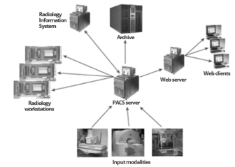

## Workflow PACSS

Un workflow PACS suit généralement ces différentes étapes:

1. <ins>Demande</ins>.  
   Une demande de radiologie arrive et est entrée dans le RIS:
    - nom du patient
    - numéro d'identification de l'hôpital du patient
    - date de naissance
    - nom du médecin référent
    - examen demandé
    - raison de l'examen
    - complainte principale

   Le RIS envoie un message au serveur PACS pour trouver toutes les images historiques du patient  
   et les mettre dans les archives à court terme.

2. <ins>Examen</ins>.  
   La radio est effectuée

3. <ins>Création des fichiers</ins>.  
   Les images sont traitées et répétées si nécessaires, puis envoyées au serveur PACS. Les images sont étiquetées avec les informations du RIS afin que les images soit disponibles dans l'historique. Si le médecin du patient n'a pas accès aux images électroniques, un CD peut être réalisé. Une version papier peut également être imprimée pour que le patient l'emporte.

4. <ins>Interprétation</ins>.  
   Les images et infos du patient sont transmises au radiologue.  
   Il ou elle peut consulter les images et rapports historiques pour comparaison.

5. <ins>Transcription</ins>.  
   Le ou la radiologue crée un rapport. Parfois, un logiciel de reconnaissance vocale est utilisé pour transcrire le diagnostic. Le rapport est relu et des corrections peuvent être effectuées. Le radiologue signe ensuite le rapport, ce qui le rend définitif.

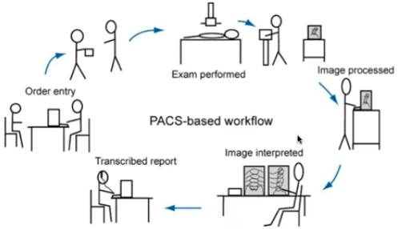

---

# Standards

## DICOM

* Au fil du temps, les fournisseurs ont commencé à offrir des PACS spécifiques à leur modalité. Est donc venu un besoin de normalisation: bien qu'il existe différents types d'images médicales, pouvant être produites par des appareils de différents fournisseurs, toutes ces images doivent fonctionner dans un format universel pour pouvoir 1. être gérées par un seul et même PACS et 2. être partagées entre différents établissements médicaux et professionnels de santé.

* DICOM (*Digital Imaging and Communications in Medicine*) est un standard créé en 1985 pour répondre au besoin d'avoir des PACS compatibles. DICOM a depuis été universellement accepté et a jeté les bases des futurs développement PACS — aujourd'hui tous les fournisseurs de modalités se vantent d'avoir la compatibilité DICOM.

* DICOM définit des normes pour 5 grandes fonctionnalités:
  1. transmission et stockage d'objets (images, ondes, rapports structurés, documents)
  2. recherche et extraction des données
  3. implémentation d'actions spécifiques (ex impression)
  4. worfklow management
  5. qualité de l'aspect de l'image (à l'affichage et à l'impression)

## Autres

* D'autres normes sont également utilisées, dont notamment

  - HL7 (*Health Level 7*): utilisé pour la communication de données textuelles entre systèmes

  - HTTP (*Hypertext transfer protocol*): utilisé pour la transmission d'informations sur Internet et sur les réseaux locaux

  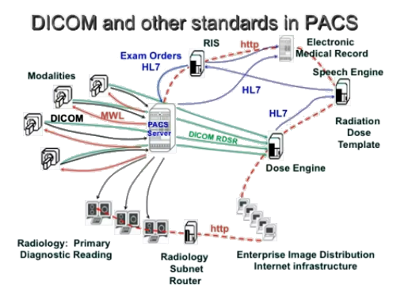

---

# Méthodes d'acquisition

* L'imagerie médicale repose sur la capacité de l'énergie à pénétrer les tissus. Les phénomènes utilisés différent suivant la modalité choisie — l'absorption des rayons X dans le cas de la radiographie standard ou CT-scan, les fréquences émises par les atomes d'hydrogène lorsqu'ils sont exposés à un champ magnétique dans le cas de l'IRM, ou encore la réflexion d'ondes ultrasons dans le cas l'échographie. Mais quelle que soit la forme physique du signal, le principe reste le même: 1. émettre de l'énergie en direction de l'objet examiné, 2. détecter la quantité d'énergie renvoyée.

## Radio

* Une radiographie conventionnelle mesure l'intensité des rayons X parvenant au détecteur après avoir traversé le patient. L'image obtenue est une projection 2D d'un volume en 3D, ce qui pose plusieurs problèmes: A/ Les dimensions de l'objet sur l'image obtenue changent en fonction de la distance de l'objet par rapport à la source des rayons X et aux détecteurs, ce qui donne un effet d'agrandissement ou de réduction des dimensions. B/ Des objets à différentes profondeurs seront projetés sur un même plan, les informations contenues dans l'image seront ainsi masquées par superposition. C/ Il est difficile de situer les éléments les uns par rapport aux autres.

  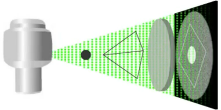

## Scanner

* Le scanner utilise les mêmes principes physiques que la radiographie: c'est l'atténuation d'un faisceau de rayons X après son passage à travers un organisme; mais contrairement à la radiographie standard, le scanner explore le volume en réalisant de multiples projections de plans selon différents angles. L'idée clé étant qu'en regardant l'objet à partir de plusieurs angles différents, une image complète peut être obtenue.

* L'objet (c'est à dire la partie du corps du patient, ce qu'on appelle également le *champ de vue*) est découpé en petits éléments réguliers: les *voxels*. Le voxel est la plus petite unité de mesure d'un objet en 3D. Le scanner va tourner autour de l'objet et mesurer la quantité de rayons X absorbée par chaque voxel à partir de différents angles.

  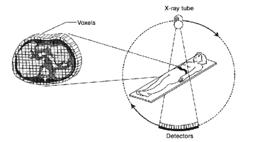

  La valeur du pixel sera la somme de toutes les mesures effectuées pour le voxel associé. Le pixel constitue alors le plus petit élément surface de l'image numérique. Plus ces pixels sont petits et que la taille de la matrice est élevée, plus la visualisation des détails sera meilleure. Il peut y avoir plusieurs artéfacts lors de la conversion analogique/numérique — c'est à dire lors du passage d'un signal réel continu à une image composée de valeurs discrètes.

  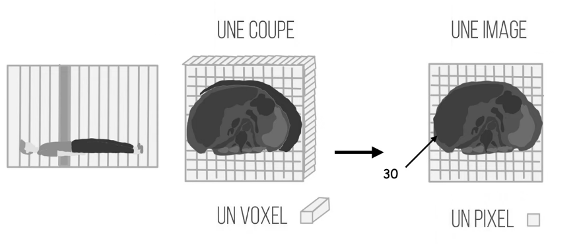

* La *reconstruction* de l'image fait référence au processus de convertion, à partir de la projection des rayons du X du patient irradié, à une image numérique. La reconstruction d'image est une tâche intensive en calculs, et une des étapes les plus cruciales du processus d'imagerie par TDM.

* L'image finale obtenue par le scanner est enregistrée sous la forme d'une image numérique, autrement dit d'une matrice (un tableau en 2 dimensions), qui contient des valeurs discrètes.
  L'image correspond à la distribution des atténuations causées par chacun des tissus traversés. Pour faire simple, le principe de la tomographie est de remplacer chaque point dans l'espace contenu dans le volume exploré de l'être humain par une valeur numérique spécifique aux tissus occupant ce point. Ce n'est plus l'ombre des structures superposées, mais une coupe précise dans laquelle les organes apparaissent non superposés et clairement situés les uns par rapport aux autres.

  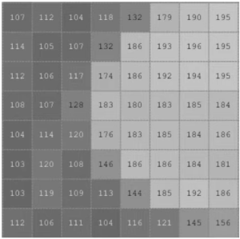

# Images obtenues

## Dimensions

* Les constructeurs de scanners proposent plusieurs dimensions de matrice de reconstruction d'image, des matrices carrées allant de 128 jusqu'à 1024 ou rectangulaire 512x2048 selon les régions anatomiques à explorer. Les capacités nécessaires, tant au niveau des mémoires qu'à celui des processeurs de calcul, augmente corrélativement.

## Coefficient d'atténuation

* Durant un scan, le volume à explorer est bombardé par des photons X — avec une énergie généralement entre 20 et 140keV. On appelle conventionnellement I0 l'**intensité du rayonnement** mesuré juste à la sortie du tube à rayons X.

* Lorsqu'il traverse le corps, le faisceau de rayons X rencontre de la matière et de ce fait, il subit une modulation appelé l'**atténuation**. Celle-ci est d'autant plus importante que le corps est épais, que la matière est dense, ou que le numéro atomique des atomes constituant les tissus est important.

* Le **coefficient d'atténuation** linéaire, noté &mu;, quantifie l'atténuation occasionné par un matériau (et est proportionnel à la quantité d'énergie en entrée comme son nom l'indique). Parce que ce n'est pas très important, on peut considérer que le coefficient d'atténuation est juste la différence entre la quantité d'énergie en entrée I0 et la quantité d'énergie en sortie I1.

  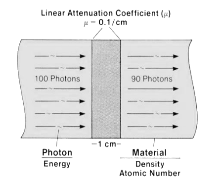

* C'est le coefficient d'atténuation qui est sauvegardé en binaire dans le fichier. Bien que le coefficient d'atténuation soit typiquement exprimé en /cm, pour éviter les imprécisions liées aux puissances de 2 inférieures à 0, les valeurs enregistrées ne sont pas des nombres décimaux mais des entiers. 

* Quelques coefficients d'atténuation linéaire, pour différents matériaux,  
  à des énergies de rayons gamma de 100, 200 et 500 keV:

  | Absorber   | 100keV       | 200keV      | 500keV
  |---         |---           |---          |---
  | Air        | 0.000195/cm  | 0.000159/cm | 0.000112/cm
  | Eau        | 0.167/cm     | 0.136/cm    | 0.097/cm
  | Carbone    | 0.335/cm     | 0.274/cm    | 0.196/cm
  | Aluminium  | 0.435/cm     | 0.324/cm    | 0.227/cm
  | Fer        | 2.72/cm      | 1.09/cm     | 0.655/cm
  | Cuivre     | 3.8/cm       | 1.309/cm    | 0.73/cm
  | Plomb      | 59.7/cm      | 10.15/cm    | 1.64/cm

  [X-Ray Mass Attenuation Coefficients](https://physics.nist.gov/PhysRefData/XrayMassCoef/tab3.html)

# Utilisation des images

## Unité Hounsfield

* Pour un même objet, le coefficient d'atténuation peut varier — en fonction de la puissance en keV utilisée et des filtres qui peuvent être ajoutés. Au lieu d'utiliser directement ces coefficients, Hounsfield (un ingénieur britannique) a eu l'idée de normaliser ces valeurs par rapport au coefficient d'atténuation de l'eau.

  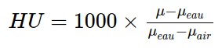

* Lorsque le coefficient d'atténuation est converti avec la méthode de Hounsfield,  
  on parle d'**unité Hounsfield**, abbrégé HU (pour *Hounsfield Unit*). 

* Quel que soit leur coefficient d'atténuation, une fois normalisé, l'eau aura une valeur de 0 HU, et l'air environ -1000 HU. Ainsi, quel que soit le scanner utilisé, les radiologues peuvent comparer les patients ou même leurs scans passés.

* Les unités Hounsfield vont typiquement de -1000 à +1000. Plus les tissus sont denses, plus ils auront des valeurs HU élevées. Les scanners modernes peuvent aller jusqu'à +4000, mais à part le métal, rien ne sera supérieur à +1000 donc on peut se concentrer sur l'intervalle ±1000 HU.

## Le besoin de contraste

* L'intervalle de Hounsfield a environ 2000 valeurs possibles (de -1000 à +1000) alors qu'un écran classique peut afficher 256 nuances de gris différentes.
  Pire encore, l'œil a besoin d'une variation environ supérieure à 6% sur l'échelle des gris pour distinguer deux couleurs différentes — entre #f7f7f7 et #f7f7f6, on ne voit aucune différence. Autrement dit, il faudrait une différence d'au moins 120 HU pour distinguer deux nuances de gris différentes.

  

  
Pourquoi 120 HU

  <pre>
  # Nuances de gris pouvant être distinguées par l'œil humain
  100/6 = 17

  # HU possibles pour une même nuance de gris affichée à l'écran
  2000/256 = 8

  # Différence en HU pour distinguer deux nuances de gris à l'écran
  256/17*8 = 120
  </pre>
  

<!-- -->

* La différence entre les tissus normaux et pathologiques est généralement bien inférieure à 120.  
  Par exemple, sur un scanner de la tête:

  - l'hémorragie vaudra environ 70 HU
  - la matière grise environ 40 HU
  - la matière matière blanche 25 HU
  - le liquide cérébrospinal 8 HU
  - l'air dans les sinus (s'il y en avait) -900 HU
  - l'os 800 HU

     
  À gauche, une image qui montre les 2000 unité de Hounsfield sur 256 nuances de gris:  
  aucun diagnostic ne peut en être tiré.

  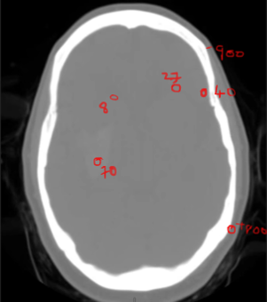
  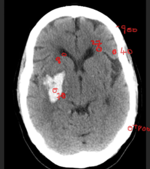

## Fenêtrage

* La solution: le **fenêtrage**. Le fenêtrage permet d'afficher une matrice de reconstruction différemment selon le type d'information qu'on souhaite obtenir.

  Dans l'exemple précédent, bien que l'image contienne une large gamme de densité (de -900 pour l'air à +800 pour l'os), seul un intervalle restreint pour intéresse — d'environ +8 à +70. On va donc réduire ces 256 nuances de gris à une fenêtre très étroite, qui contient les densités qui nous intéresse. Tout ce qui sera inférieur à l'intervalle choisit sera noir, tout ce qui sera supérieur sera blanc.

* Une fenêtre se configure avec deux valeurs:

  * le **centre** (*level*, L)
  * et la **largeur** (*window*, W)  
     

  Par exemple, si on choisit de centrer sur une densité de 40, avec une largeur de 70:
  - la valeur 40 sera grise
  - une valeur &gt;75 sera blanche (70/2=35, 40+35=75)
  - une valeur &lt;5 sera noire (40-35=5)
  - une valeur entre 40 et 75 sera une nuance de gris clair
  - et une valeur entre 5 et 40 sera une nuance de gris foncé  
     

* Le fenêtrage désigne donc le réglage permettant d'optimiser l'étude d'une région donnée. Son principe est simple:

  1. Ajuster la valeur du centre de fenêtrage au milieu des densité d'intérêt.  
     Une fenêtre centrée sur les valeurs les plus faibles sera propice à l'étude détaillée des structures les moins denses; et inversemment.  
     La modification du centre de la fenêtre permet donc de modifier la <ins>luminosité</ins> de l'image.

  2. Choisir la largeur de la fenêtre (autrement dit, choisir le min et max).  
     Cela détermine le nombre de niveaux de densité: en augmentant la fenêtre, l'image s'enrichit de niveaux de gris mais le contraste est diminué entre les structures de l'image; en diminuant la fenêtre, le contraste augmente.  
     Ainsi la largeur de la fenêtre définit le <ins>contraste</ins> de l'image restituée.

  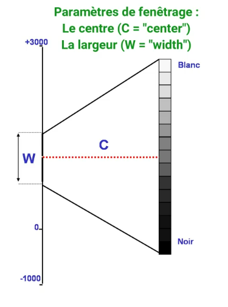

* Généralement, dans les logiciels de radiologie et visualiseuses DICOM, ces deux valeurs (le centre et la largeur de la fenêtre), s'ajustent à l'aide de la souris.
  Et pour aller plus vite, il y a des fenêtres pré-configurées (*presets*) pour différents usages courants: os, cerveau, poumons, etc.

  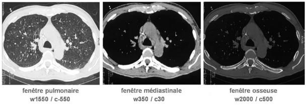
