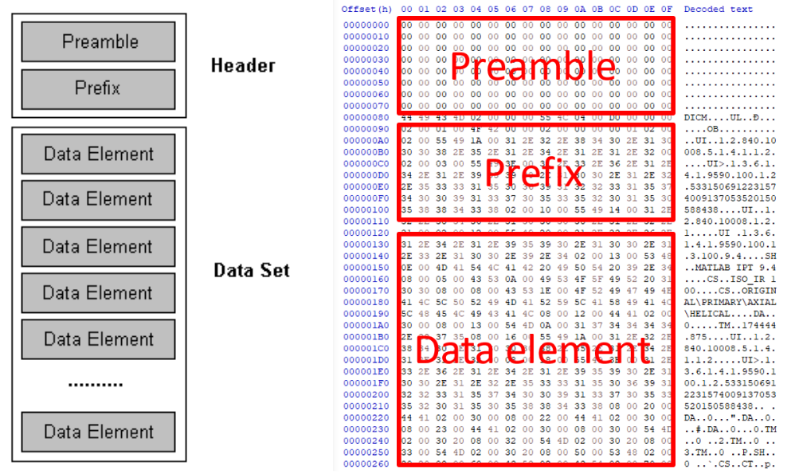
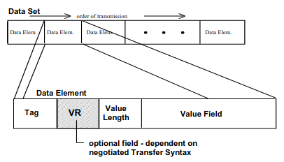
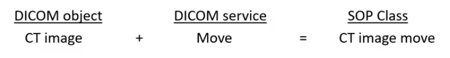

# Résumé d'Imagerie médicale

- Il existe différentes techniques d’imagerie médicale, aussi appelées **modalité**:  
  radiographie (X-rays), scanner (CT-scan), IRM (MRI), échographie (ultrasound), etc.

- Les images provenant d'équipement d'imagerie médicale suivent le standard **DICOM** (*Digital Imaging and Communications in Medicine*) — un standard qui normalise entre autres le format des fichiers, mais aussi leurs traitements et leurs échanges.

- Un serveur **PACS** (*Picture Archiving and Communication System*) est le type de serveur utilisé dans les hôpitaux pour gérer les patients et les échanges entre les différents équipements d'imagerie médicales et ordinateurs — donc un serveur qui implémente le standard DICOM.

# Terminologie DICOM

## Entité

- Pour se mettre d'accord sur les termes utilisés, DICOM propose des définitions abstraites d'un ensemble d'entités dans le "monde réel":

  - Patient
  - Visit
  - Study
  - Modality Performed Procedure Steps
  - Frame of Reference
  - Equipment
  - Series
  - Registration
  - Fiducials
  - Image
  - Presentation State
  - SR Document
  - Waveform
  - MR Spectroscopy
  - Raw Data
  - Encapsulated Document
  - Real World Value Mapping
  - Stereometric Relationship
  - Surface
  - Measurements

* Ces **entités dicom** ont des relations entre elles: un *Patient* effectue une *Visit* pour effectuer une *Study* (examen) avec un *Equipment* effectuant 1 à n *Series* (plans), contenant chacun 1 à n *Image*.

## Objet

* Un **objet dicom**, par exemple une image CT, contient les données de diverses entités — notamment le patient, la study, series et image (aussi appelé instance). Les données des relations sont répétées dans tous les fichiers: toutes les images contiendrons les mêmes données patient.

* Quelques exemples d'objets:

  - Image CT/MR/US/CR/FX/PT
  - Basic film session (DICOM print)
  - Scheduled procedure for a worklist (MWL)
  - Radiation Dose Structured Report (RDSR)

## Dataset

- Tout fichier dicom contient
    1. un header, qui décrit le type de l'objet
    2. un dataset, qui est une liste d’éléments
    
    

## Element

- Chaque **data element** (aka attribut-valeur) est constitué
    1. d’un tag, qui est une paire de deux nombres (le numéro de groupe et le numéro d’élément).
    2. optionnellement du type, appelé VR (*value representation*)
    3. de la longueur de la valeur
    4. et la valeur
    
    

    Exemple (début) d’une image CT:
    
    ```python
    from pydicom import dcmread
    x = dcmread(path)
    x
    '''
    Dataset.file_meta -------------------------------
    (0002, 0000) File Meta Information Group Length  UL: 200
    (0002, 0001) File Meta Information Version       OB: b'\x00\x01'
    (0002, 0002) Media Storage SOP Class UID         UI: CT Image Storage
    (0002, 0003) Media Storage SOP Instance UID      UI: 1.2.840.113619.2.438.3.1690322441.949.1613458287.47.201
    (0002, 0010) Transfer Syntax UID                 UI: Explicit VR Little Endian
    (0002, 0012) Implementation Class UID            UI: 1.2.276.0.7230010.3.0.3.6.1
    (0002, 0013) Implementation Version Name         SH: 'OFFIS_DCMTK_361'
    -------------------------------------------------
    (0008, 0005) Specific Character Set              CS: 'ISO_IR 100'
    (0008, 0008) Image Type                          CS: ['ORIGINAL', 'PRIMARY', 'AXIAL']
    (0008, 0012) Instance Creation Date              DA: '20210216'
    (0008, 0013) Instance Creation Time              TM: '083839'
    (0008, 0016) SOP Class UID                       UI: CT Image Storage
    (0008, 0018) SOP Instance UID                    UI: 1.2.840.113619.2.438.3.1690322441.949.1613458287.47.201
    (0008, 0020) Study Date                          DA: '20210216'
    (0008, 0021) Series Date                         DA: '20210216'
    (0008, 0022) Acquisition Date                    DA: '20210216'
    (0008, 0023) Content Date                        DA: '20210216'
    (0008, 0030) Study Time                          TM: '083619'
    (0008, 0031) Series Time                         TM: '083739'
    (0008, 0032) Acquisition Time                    TM: '083759.796465'
    (0008, 0033) Content Time                        TM: '083839'
    (0008, 0050) Accession Number                    SH: 'J10005275637'
    (0008, 0060) Modality                            CS: 'CT'
    '''
    ```

### Tag

* Le tag se présente sous la forme d'une paire de numéros de 8 bits,  
  le numéro de groupe et le numéro d'élément, soit 16 bits au total.  
    Par exemple:

    | Tag         | Nom                  | Keyword           | VR
    |---          |---                   |---                |---
    | (0010,0010) | Patient’s Name       |  PatientName      | PN
    | (0010,0020) | Patient ID           | PatientID         | LO
    | (0010,0021) | Issuer of Patient ID | IssuerOfPatientID | LO
    | (0010,0022) | Type of Patient ID   | TypeOfPatientID   | CS

* Le numéro d'élément est unique par groupe mais pas par objet,  
  c'est l'ensemble groupe-élément qui identifie le tag de manière unique dans le dataset.

* Les numéros sont presque toujours représentés en hexadécimal:  
  0010 représente le groupe 16.

* Les numéros pairs sont publiques, et les numéros impairs sont privés — que ce soit un numéro de groupe ou d'élément. Les numéros privés peuvent être utilisés par les fabricants pour ajouter des informations spécifiques à ce fabricant. Pour connaître leur signification, il faut disposer du mapping du fabricant.

* Les groupes 0000, 0002 et 004 sont des groupes particuliers: ils contiennent des metadonnées.  
  Les groupes à partir de 0008 contiennent des données.

    | Groupe  | Contenu
    |---      |---
    | 0000    | Commandes
    | 0002    | File meta
    | 0004    | Structure du répertoire
    | 0006    | (non utilisé)

* Dans la documentation, un tag peut être de type:
  - 1 = obligatoire et rempli
  - 2 = obligatoire et peut être vide
  - 3 = optionnel

### Value Representation (VR)

* Le type de données (*value representation*, VR) est une chaîne de 2 caractères.  
  Les plus couramment rencontrés sont:

    | VR | Description     | Format            | Exemple
    |--- |---              |---                |---
    | PN | Person Name     | Last^First^Middle | Seibert^James^Anthony
    | DA | Date            | yyyymmdd          | 20060614
    | TM | Time            | hhmmss.frac       | 091545.87934
    | UN | Unsigned Number | n                 | 2

  [Liste complète: Value Representation](https://dicom.nema.org/medical/dicom/current/output/chtml/part05/sect_6.2.html#table_6.2-1)

* La VR n'est pas obligatoirement écrite dans le fichier pour les données standard (numéros de groupe pairs), puisqu'elle est fixée par le standard. En revanche les données spécifiques à un fabriquant auront forcement une VR explicite — puisqu'elle ne peut pas être connue des logiciels qui ne sont pas de ce fabricant.

### Longueur de valeur

* La longueur de la valeur est un nombre entier non signé (sur 16 ou 32 bits suivant la VR)  
  qui spécifie le nombre d'octets composant la valeur — ce sera forcement un nombre pair.

* Les attributs de format *Sequence of Items* (SQ) et *Unknown* (UN) ont une longueur indéfinie (FFFFFFFFH): la valeur doit être terminée plus tard dans le flux d'octets avec une balise spéciale (*Item* ou *Sequence* Delimitation). Pour les formats OW ou OB, une valeur indéfinie peut être utilisé suivant le transfert négocié.

## IOD

- La liste complète des données qu’un objet dicom peut contenir  
  est définit dans une **IOD** (*Information Object Definition*) par le standard DICOM.

    - une IOD qui représente une seule entité DICOM est dite **normalisée**

    - une IOD qui contient les attributs de plusieurs entités est dite **composite**.  
      La plupart sont composites, et c’est le cas des images

- Pour s’y retrouver, les attributs de l’IOD sont regroupés par IE. Une **IE** (*Information Entity*) est simplement un ensemble d’attributs portant sur une entité donnée dans un IOD donné. Par exemple l'IE patient de l’IOD CT image = nom du patient, ID du patient, etc.

    

* Une IE peut contenir différents **modules**, qui sont des sous-groupes d'IE.  
  Un module est ni plus ni moins qu'un label donné à un groupe d'attributs pour faciliter la lecture de la documentation.  
  Exemple:

  | IE       | Module
  |---        |---
  | Study | General Study
  | Study | Patient Study
  | Study | Clinical Trial Study 

* Dans la documentation DICOM, la dernière colonne du tableau indique si le module est obligatoire (M pour Mandatory), conditionnel (C) ou optionnel (U pour User option).

    [Documentation: CT image IOD](https://dicom.nema.org/dicom/2013/output/chtml/part03/sect_A.3.html)

## DICOMweb

* Les services DICOM exécutent des fonctions telles que le déplacement, la recherche et le stockage des objets DICOM. 

* DICOMweb est le standard qui normalise les services DICOM RESTful.  
  Ces services sont:

  | Service      | Nom      | Description
  |---           |---       |---
  | Query        | QIDO-RS (*Query based on ID for DICOM Objects*) | Rechercher des objets DICOM
  | Retrieve     | WADO-RS (*Web Access to DICOM Objects*) | Récupérer des objets DICOM
  |              | WADO-URI | Récupérer un objet DICOM
  | Store        | STOW-RS (*Store Over the Web*)  | Stocker des objets DICOM
  | Worklist     | UPS-RS (*Unified Procedure Step*)  | Gestion
  | Capabilities |          | Découvrir les services du serveur

  [Format des URLS](https://www.dicomstandard.org/using/dicomweb)

* L'application DICOM qui envoie le message est appelé le **SCU** (*Service Class User*) ou client.  
  Celle qui reçoit le message est le **SCP** (*Service Class Provider*) ou serveur.

* Chaque message DICOM commence par un flux d'octets appelé **DIMSE** (*DICOM Message Service Element*)  
  qui spécifie l'action demandée. Par exemple

  * le DIMSE "C-ECHO" demande à un appareil une confirmation qu'il a reçu la requête

  * le DIMSE "C-STORE" demande à un appareil de stocker des données

* Lorsqu'un DIMSE est associé à un objet, on parle de **SOP** (*Service Object Pair*).  
  Par exemple, si on utilise un C-MOVE sur un object CTimage (pour déplacer une image CT d'un endroit à un autre), alors il s'agit du SOP "CTimage move".

  

    En général, les termes "classe SOP" (SOP Class) et "syntaxe abstraite" (Abstract Syntax) sont interchangeables, la seule différence étant que que le terme "syntaxe abstraite" est davantage utilisé quand on parle de négociation des échanges: elles sont l'unité négociée lors de l'établissement de l'échange.

## DCM

* L'extension .dcm désigne un fichier DICOM. L'extension dcm n'est pas obligatoire et souvent les fichiers sont identifiés par de simples numéro: à l'issue d'un examen médical, un dossier DICOMDIR contient la liste des fichiers générés — images (compressées ou non), parfois des vidéos, voire des comptes rendus.
