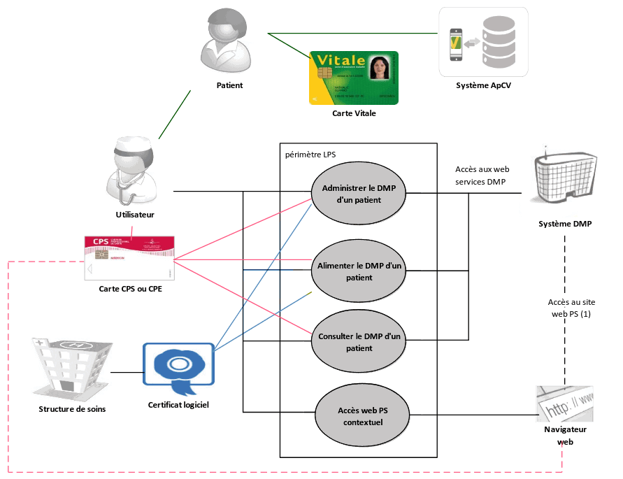
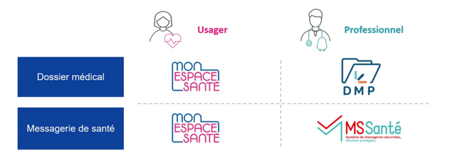

## Qu'est-ce que c'est

* Le Dossier Médical Partagé (DMP) est un service numérique pour conserver les informations de santé des patients dans un espace sécurisé en ligne. Carnet de santé gratuit, confidentiel, et non obligatoire, le DMP conserve différentes données:

    - Historique des remboursements des 12 derniers mois
    - Traitements médicamenteux et soins
    - Pathologies et allergies éventuelles
    - Comptes rendus (consultation, opératoire, etc.)
    - Résultats d’examens (radiologie, biologie, etc.)
    - Directives anticipées
    - Carnet de vaccination

* La visibilité d’un document dans le DMP est gérée par rapport à trois populations: les professionnels de santé, les patients, et les représentants légaux du patient.
  Un document peut être visible ou non pour chacune de ces populations, toutes les combinaisons de visibilité sont possibles.

<!--
* Le DMP est hébergé par un Hébergeur de Données de Santé (HDS),
  agréé par le Ministère en charge de la Santé.
-->

## Accès pour un professionnel de santé

* **Identification**:  
  <ins>Directe</ins>:  
  Les Professionnels de Santé (PS) accèdent au DMP d’un patient grâce à leur carte CPS,  
  soit via leur logiciel métier (s'il compatible avec le DMP) soit via le site dmp.fr.  

  <ins>Indirecte</ins>:  
  Si le PS utilise un Logiciel de Professionels de Santé (LPS) hébergé au sein d’une structure de soins, cette structure s'authentifie auprès du système DMP avec un certificat logiciel — une authentification pour personne morale. L'accès au DMP nécessite une identification nominative, il faut donc que le PS s’authentifie localement. La structure porte la responsabilité des échanges avec le système DMP et l’identification de l’utilisateur final (PS).

  <!--
  
  
  -->

* **Autorisation d'accès**.  
  L'autorisation d’accès est facultative pour alimenter, archiver ou supprimer des documents dans le DMP.  
  Lors de l'alimentation, le statut de visibilité du document peut être choisit pour chaque population (PS, patient, représentants légaux).
  Seul l’auteur d'un document peut le supprimer.  

  Pour la gestion administrative et la consultation, l'autorisation d'accès est obligatoire.  
  En lecture, les conditions d'accès aux documents contenus dans le DMP d’un patient dépendent des professions et spécialités des PS recueillies à partir de la carte CPS du PS. Ces règles sont définies dans la [matrice d’habilitation](https://www.dmp.fr/documents/d/dmp/matrice-habilitation) (DMP-MHAB).

  Les accès des professionnels de santé sont tracés et accessibles au patient ainsi qu’à son médecin traitant.

  

* Cas particuliers, en cas d'urgence:

  - Le mode "bris de glace":  
    S'il n'y a pas la possibilité de demander l'autorisation du patient, et que son état  comporte un risque immédiat pour sa santé, tout professionnel de santé peut utiliser le mode d’accès "bris de glace" pour consulter le DMP du patient en renseignant le nom du patient, son prénom, sa date de naissance et la justification de l’accès

  - Le mode "centre de régulation":  
    Les permanenciers auxiliaires de régulation médicale dans les centres d'appel du SAMU (15) peuvent accéder au DMP d’un patient pour lequel ils reçoivent un appel — sans avoir à justifier le motif de leur accès.

## Accès patient

* Le site Mon Espace Santé permet au patient d'accéder à son DMP et d'en modifier le contenu

  

Source:  
[Dossier Médical Partagé](https://segurnumerique.sante-idf.fr/segur-et-services-socles/services-socles/dmp/),  
[Le Dossier Médical Partagé (DMP) en pratique](https://www.ameli.fr/isere/medecin/sante-prevention/dmp-et-mon-espace-sante/dossier-medical-partage/dmp-en-pratique)

## DPI, DUI

* L’alimentation du DMP peut être effectuée depuis les DPI ou DUI des établissements.

  * Les logiciels **Dossier Patient Informatisé (DPI)**  
    sont utilisés par les établissements du domaine sanitaire pour stocker, organiser et gérer l'ensemble des données de santé d'un patient.

  * Les logiciels **Dossier Usager Informatisé (DUI)**  
    sont utilisés par les établissements du secteur social ou médico-social pour centraliser les informations médicales, sociales et administratives d’une personne prise en charge. Tout d'abord circonscrit au secteur sanitaire, le numérique en santé s'étend de plus en plus sur les secteurs sociaux et médico-sociaux, on ne parle alors plus de "patient" mais d'"usager" ou de "personne prise en charge"

### Généralisation du DUI

* Avec le soutien l’Europe (programme NextGenerationEU) et de France Relance,  
  la CNSA a lancé un appel à projet en 2023 pour soutenir l’équipement des Établissements et services Sociaux et Médico-Sociaux (ESMS) en

  - **Dossier Usager Informatisé (DUI)**, contenant des informations administratives, médico-sociales et autres relatives à l'usager
    * Dossier administratif
    * Historique du parcours
    * Dossier de soins
    * Gestion électronique documentaire (GED)
    * Statistiques

  - **Agenda partagé**, permettant aux professionnels de planifier et de suivre les interventions.
    * Calendrier des présences/absences
    * Agenda de l’usager
    * Projets personnalisés et évaluations
    * Entretiens individuels
    * Observations et évènements indésirables

  - **Outil de Coordination des acteurs**, permettant aux professionnels d'échanger des informations en temps réel
    * Agenda des professionnels
    * Écrits collaboratifs et publipostage
    * Messagerie instantanée
    * Messagerie sécurisée

Source:  
[Qu'est-ce que le DUI?](https://professionnels.monespaceautonomie.fr/quest-ce-que-le-dui/)  
[Transfert de données DUI](https://interop.esante.gouv.fr/ig/fhir/tddui/NormesStandards_TransfertDonneesDUI_V1.0.pdf)

## Identifiant du DMP

* Le **matricule Identité Nationale de Santé (INS)** est l’identifiant du DMP.   
  Antérieurement, l'identifiant du DMP d'un patient était un Identifiant National de Santé dit "Calculé" (INS-C), généré à partir du  Numéro d'Inscription au Répertoire national (NIR) de l'individu et d’autres éléments d’identification — prénom, date de naissance. Le système DMP gère les deux identifiants pour le DMP de chaque patient.

* En cas d'erreur d’alimentation au DMP détecté (le document est alimenté au niveau d’un mauvais DMP, malgré l’exigence de qualification préalable de l’INS),
  l'établissement doit, conformément au RGPD, procéder aux transactions de modification ou suppression du document concerné.

## Format des documents historiques

* Les documents historiques repris doivent être alimentés au format **CDA (HL7 Clinical Document Archivecture) R2 N1**, qui est une structure XML.
  Concrètement, pour l’historique, il faut mettre en entête les métadonnées (identité du patient, auteur, date du document, etc.) et encapsuler dans le corps non structuré le document, généralement en pdf. Ce dernier ne nécessite pas d’être modifié pour l’opération (pas d'ajout du datamatrix INS)

* Pour plus d'informations, consulter

  - le Cadre d'Interopérabilité des Systèmes d’Information en Santé (CI-SIS),  
    dans le [volet structuration minimale des documents de santé](https://esante.gouv.fr/volet-structuration-minimale-de-documents-de-sante)

  - le guide d’intégration DMP

  - les jeux d’exemple fournis par l’ANS  
    dans l’[archive test des contenus CDA](https://esante.gouv.fr/annexe-testContenuCDA)

## Charge à la réception

* En termes de charge à la réception côté DMP, si les engagements de service sont importants
  et ont pu être éprouvés pour des alimentations en masse avec les SI Covid-19, il convient de
  prévoir avec l’éditeur de logiciel de santé et/ou la plateforme d’intermédiation impliquée

  - de ne faire appel qu’aux transactions strictement nécessaires:  
    ne pas effectuer d'appels pour des informations déjà bien référencées dans le logiciel (ex: pas de TD0.2 si l'existence du DMP est déjà connu, pas de TD0.3 pour autorisation préalable à l’alimentation, pas de TD3.2 si inutile de vérifier la pré-existence du document au DMP)

  - de mettre en place une manière de contrôler les flux de reprise,  
    en limitant à moins de 5 transactions d’alimentation par seconde pour un couple établissement + logiciel donné

  - de privilégier des plages horaires non ouvrées pour des reprises automatisées

  - en cas d’alimentation particulièrement importante (> 30 000 documents par jour),  
    l’établissement concerné doit signaler en amont, le planning et l’ampleur des opérations prévus, à l’Assurance Maladie (aux deux adresses de contact suivantes: <ins>dmp-moamoe.cnam@assurance-maladie.fr</ins> et <ins>dlfr-dmp1-expl-gds@worldline.com</ins>) et son éditeur peut se rapprocher du GIE SESAM-Vitale en cas de questions techniques sur les interfaces

  - de tester préalablement ce type de rattrapage réinitialisé quotidiennement sur l’environnement de formation FO3, en limitant les tests à 20 documents alimentés par jour, puis sur des périmètres de production restreints

Source:  
[Guide explicatif pour l’enrichissement du DMP](https://sante.gouv.fr/IMG/pdf/sun_es_guide_reprise_documents_historiques_dpi_vers_dmp_v1_5.pdf)  
[Service DMP intégré aux LPS](https://www.sesam-vitale.fr/documents/20182/54758/SEL-MP-037+DMPi.pdf)
