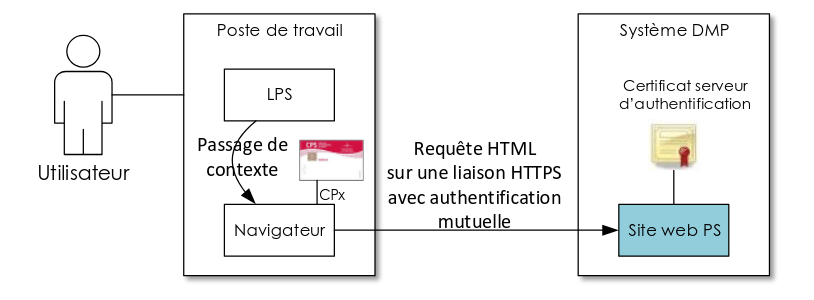
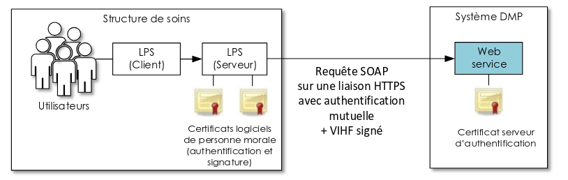
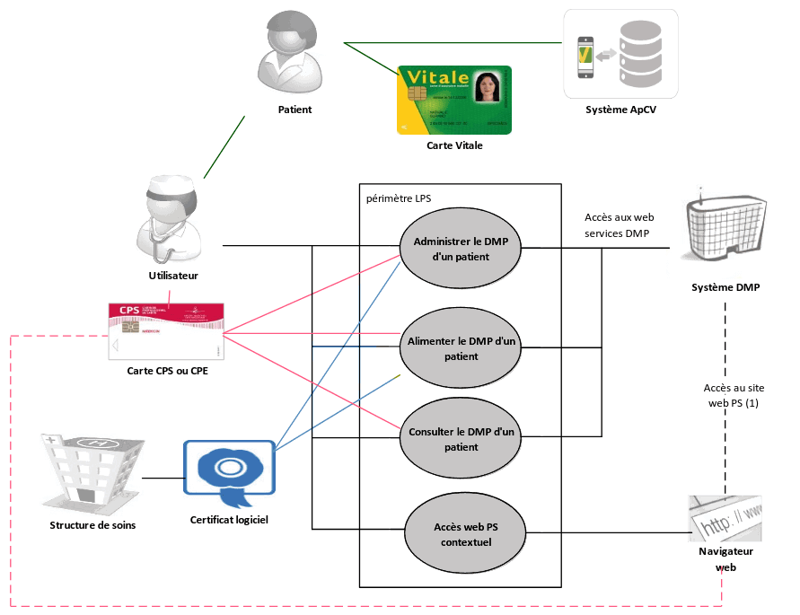

## Qu'est-ce que c'est

* Le Dossier Médical Partagé (DMP) est un carnet de santé numérique qui conserve dans un espace sécurisé les informations de santé de tous les patients en France. Gratuit, confidentiel, et non obligatoire, le DMP conserve en ligne les données de santé suivantes:

    - Historique des remboursements des 12 derniers mois (alimenté automatiquement)
    - Traitements médicamenteux et soins
    - Pathologies et allergies éventuelles
    - Comptes rendus (consultation, opératoire, etc.)
    - Résultats d’examens (radiologie, biologie, etc.)
    - Directives anticipées
    - Carnet de vaccination

* La visibilité d’un document est gérée par rapport à trois populations: les professionnels de santé, les patients, et les représentants légaux du patient.  
  Un document peut être visible ou non pour chacune de ces populations.  
  Toutes les combinaisons de visibilité sont possibles.

* Le DMP est hébergé par un Hébergeur de Données de Santé (HDS),  
  agréé par le Ministère en charge de la Santé.

## Accès aux professionnel de santé

* **Identification**:  
  <ins>Directe</ins>:  
  Les Professionnels de Santé (PS) accèdent au DMP d’un patient grâce à leur carte CPS,  
  soit via leur logiciel métier (s'il compatible avec le DMP) soit via le site dmp.fr.  

  <ins>Indirecte</ins>:  
  Si le PS utilise un Logiciel de Professionels de Santé (LPS) hébergé au sein d’une structure de soins, cette structure s'authentifice auprès du système DMP avec un certificat logiciel — qui est une authentification pour personne morale. L'accès au DMP nécessite une identification nominative, il faut donc que le PS s’authentifie localement, dans le LPS. La structure porte la responsabilité des échanges avec le système DMP et l’identification de l’utilisateur final.

  <!--
  
  
  -->

* **Autorisation d'accès**.  
  L'autorisation d’accès est facultative pour alimenter le DMP avec des documents, archiver ou supprimer des documents.  
  Lors de l’alimentation du DMP du patient avec un document, on peut choisir un statut de visibilité pour chaque population (PS, patient, représentants légaux).
  Seul l’auteur du document peut le supprimer.  

  Pour la gestion administrative et la consultation, l'autorisation d'accès est obligatoire.  
  En lecture, les conditions d'accès aux documents contenus dans le DMP d’un patient (sur lequel ils ont l’autorisation d’accès) dépendent des professions et spécialités des PS recueillies à partir de la carte CPS du PS. Ces règles sont définies dans la [matrice d’habilitation](https://www.dmp.fr/documents/d/dmp/matrice-habilitation) (DMP-MHAB).

  Les accès des professionnels de santé sont tracés et accessibles au patient ainsi qu’à son médecin traitant.

  

  Cas particuliers, en cas d'urgence:

  - Mode "bris de glace"  
    Si l’état du patient comporte un risque immédiat pour sa santé (sans avoir la possibilité de lui demander son autorisation), tout professionnel de santé peut utiliser le mode d’accès "bris de glace" pour consulter le DMP du patient, en renseignant le nom du patient, son prénom, sa date de naissance et la justification de l’accès du professionnel de santé.

  - Mode "centre de régulation"  
    Les permanenciers auxiliaires de régulation médicale des centres de réception et de régulation des appels des SAMU-Centres 15 peuvent accéder au DMP d’un patient pour lequel ils reçoivent un appel, sans avoir à justifier le motif de son accès.

## Accès patient

* Le site Mon Espace Santé permet au patient d'accéder à son DMP et d'en modifier le contenu

  

Source:  
[Dossier Médical Partagé](https://segurnumerique.sante-idf.fr/segur-et-services-socles/services-socles/dmp/),  
[Le Dossier Médical Partagé (DMP) en pratique](https://www.ameli.fr/isere/medecin/sante-prevention/dmp-et-mon-espace-sante/dossier-medical-partage/dmp-en-pratique)

## DPI, DUI

* L’alimentation du DMP est effectuée depuis les DPI ou DUI des établissements.  
  Elle est également possible via les API de Mon Espace Santé

  * Le **Dossier Patient Informatisé (DPI)**  
    est un système informatisé utilisé par les professionnels de santé pour
    stocker, organiser et gérer les informations médicales d’un patient. Le DPI est utilisé par les professionnels de santé, tandis que le DMP est accessible aux patients eux-mêmes

  * Le **Dossier Usager Informatisé (DUI)**   
    est un outil numérique qui permet de
    centraliser les informations médicales, sociales et administratives d’un patient dans un même dossier

* Avec le soutien l’Europe (programme NextGenerationEU) et de France Relance,  
  la CNSA a lancé un appel à projet en 2023 pour soutenir l’équipement des Établissements et services Sociaux et Médico-Sociaux (ESMS) en

  - **Dossier Usager Informatisé (DUI)**, contenant des informations administratives, médico-sociales et autres relatives à l'usager
    * Dossier administratif
    * Historique du parcours
    * Dossier de soins
    * Gestion électronique documentaire (GED)
    * Statistiques

  - **Agenda partagé**, permettant aux professionnels de planifier et de suivre les interventions.

    * Calendrier des présences/absences
    * Agenda de l’usager
    * Projets personnalisés et évaluations
    * Entretiens individuels
    * Observations et évènements indésirables

  - **Outil de Coordination des acteurs**, permettant aux professionnels d'échanger des informations en temps réel

    * Agenda des professionnels
    * Écrits collaboratifs et publipostage
    * Messagerie instantanée
    * Messagerie sécurisée

Source:  
[Qu'est-ce que le DUI?](https://professionnels.monespaceautonomie.fr/quest-ce-que-le-dui/)  
[Transfert de données DUI](https://interop.esante.gouv.fr/ig/fhir/tddui/NormesStandards_TransfertDonneesDUI_V1.0.pdf)

## Alimentation du DMP

### Identité Nationale de Santé (INS) et identitovigilance

* Le **matricule Identité Nationale de Santé (INS)** est l’identifiant du DMP,
  il correspond généralement au Numéro d’Identification au Répertoire (NIR) de la personne
  (et non pas celui de son parent, erreur malheureusement fréquente en cas de l’utilisation
  du numéro de sécurité sociale).

* Antérieurement, l'identifiant du DMP d'un patient mis en œuvre était un Identifiant National
de Santé dit "Calculé" (INS-C), généré à partir du NIR de l'individu et d’autres éléments
d’identification (prénom, date de naissance). Le système DMP gère les deux identifiants pour le DMP de chaque patient.

* Dans le cas exceptionnel d’erreur d’alimentation au DMP détectées par l’établissement (document
  alimenté au niveau d’un mauvais DMP, malgré l’exigence de qualification préalable de l’INS), il
  convient, conformément au RGPD, que l’établissement procède, sur les dossiers concernés, aux
  transactions de modification ou de suppression du document concerné, conformément à la
  transaction prévue dans le guide d’intégration DMP (TD3.3c) qui est obligatoire pour un logiciel ayant
  le profil "alimentation"

### Documents historiques: format CDA

* Conformément au guide d’intégration DMP et au cadre d'interopérabilité des systèmes
  d’information en santé (CI-SIS), les documents historiques repris doivent être alimentés au format XML **HL7 Clinical Document Archivecture (CDA) R2 N1**

  Concrètement, pour l’historique, il s’agit uniquement de positionner en en-tête les métadonnées
  (identité du patient, établissement et/ou professionnel auteur, date du document, etc.),
  en encapsulant dans le corps non structuré le document historique, généralement en pdf.
  Ce dernier ne nécessite pas d’être modifié pour l’opération (ex : pas de rajout du datamatrix INS, etc.)

* Pour plus d’informations sur les CDA, consulter
  - le [volet structuration minimale des documents de santé du CI-SIS](https://esante.gouv.fr/volet-structuration-minimale-de-documents-de-sante)
  - les jeux d’exemple fournis par l’ANS dans l’[archive test des contenus CDA](https://esante.gouv.fr/annexe-testContenuCDA)

### Charge à la réception

* En termes de charge à la réception côté DMP, si les engagements de service sont importants
  et ont pu être éprouvés pour des alimentations en masse avec les SI Covid-19, il convient de
  prévoir avec l’éditeur de logiciel de santé et/ou la plateforme d’intermédiation impliquée

  - de veiller à ne faire un appel qu’aux strictes transactions nécessaires (ex: pas de
    TD0.2 si l'existence du DMP déjà connu, pas de TD0.3 pour autorisation préalable à
    l’alimentation, pas de TD3.2 si inutile de vérifier la pré-existence du document au
    DMP si cette information est bien déjà référencée dans le logiciel, etc.)

  - de mettre en place une manière de contrôler les flux de reprise, en limitant à moins
    de 5 transactions d’alimentation par seconde pour un couple établissement + logiciel
    donné

  - de privilégier des reprise sur des plages horaires non ouvrées pour des reprises
    automatisées

  - en cas d’alimentation particulièrement importante (> 30 000 documents par jour), il
    convient que l’établissement concerné avertisse en amont l’Assurance Maladie du
    planning et de l’ampleur des opérations aux deux adresses de contact suivantes:
    <ins>dmp-moamoe.cnam@assurance-maladie.fr</ins> et <ins>dlfr-dmp1-expl-gds@worldline.com</ins>, en lien
    avec son éditeur qui peut également se rapprocher du GIE SESAM-Vitale en cas de
    questions techniques sur les interfaces

  - de pouvoir tester préalablement la cinématique de ce type de rattrapage sur
    l’environnement de formation dénommé FO3 du DMP, réinitialisé quotidiennement,
    en limitant les tests à 20 documents alimentés par jour, puis sur des périmètres de
    production restreints

Source:  
[Guide explicatif pour l’enrichissement du DMP](https://sante.gouv.fr/IMG/pdf/sun_es_guide_reprise_documents_historiques_dpi_vers_dmp_v1_5.pdf)  
[Service DMP intégré aux LPS](https://www.sesam-vitale.fr/documents/20182/54758/SEL-MP-037+DMPi.pdf)
