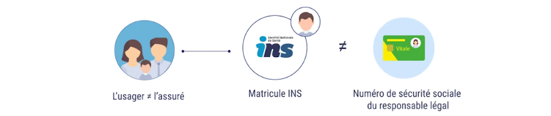

## Qu'est-ce que c'est

* L'**Identité Nationale de Santé (INS)** est une identité unique de référence associée à un usager.  
  Elle permet aux professionnels de santé de s'assurer ques les documents de santé sont assignés au bon patient, et limiter les risques de confusion entre deux usagers ainsi que les risques de doublons. Elle permet également de faciliter l'échange et le partage des données, via MSSanté ou le DMP — où l'INS est utilisé comme identifiant

* L'INS est constituée de

  * 5 traits d'identités obligatoires:
    - nom de naissance
    - prénom(s) de naissance
    - date de naissance
    - sexe
    - code officiel géographique ou lieu de naissance

  * d'un matricule.  
    Il correspondant au Numéro d'Inscription au Répertoire national (NIR) — aussi appelé numéro de sécurité sociale,  
    ou à défaut au Numéro Identifiant Attente (NIA) pour les personnes en cours d'immatriculation (personnes non nées en France mais bénéficiaires de l'Asssurance Maladie).  
    Il sera accompagné d'un OID, identifiant de la structure à l'origine de l'attribution du NIR ou du NIA.

  * et éventuellement de traits complémentaires.  
    Le nom et prénom d'usage (recueil obligatoire si différent du nom de naissance ou du 1er prénom de naissance), ou encore les coordonnées téléphoniques et postales.

  

* L'INS permet de garantir l'unicité de l'identification de l'usager, contrairement au numéro de sécurité sociale qui peut être partagé par différents usagers — notamment par les membres d'une même famille, par exemple dans le cas d'une prise en charge d'un enfant par son parent

  

* Seuls les étrangers non nés en France, non bénéficiaire d'un régime de sécurité sociale ne disposent pas d'INS — touristes de passage, bénéficiaires AME (Aide Médicale d'État)

## Notes complémentaires

* Les traits d’identité doivent être saisis en caractères majuscules non accentués,  
  sans signe diacritique et sans abréviation, mais en conservant les traits d’union et apostrophes.

  Note: la loi n°118 du 2 Thermidor An II (20 juillet 1794) dispose que les actes publics doivent être écrits en langue française sur le territoire de la République. Le nom d'une personne d'origine étrangère doit être inscrit en ne retenant que les voyelles et consonnes connues de la langue française.

* L'INS apparaîtra sur les documents de santé, en clair et en code barre Datamatrix, et permettra l'échange des données entre professionels via le DMP et les MSSanté pour la prise en charge et le suivi de l'usager. L'usager aura accès à ses informations via Mon Espace Santé

## Identitovigilance

* L'identitovigilance est définie comme l’ensemble des mesures mises en œuvre pour fiabiliser l’identification de l’usager. Elle a pour objet de lutter contre les erreurs d'identification et leurs conséquences, et fait intégralement partie de la démarche qualité et de la Gestion Des Risques (GDR)

* La Gestion Des Risques peut se décliner en deux approches complémentaires, qui poursuivent le même but:  
  apprendre de ses erreurs et de celle des autres

  - **GDR a priori**: avant l'erreur.  
    Vise à prévenir la survenue d'Événements Indésirables (EI) évitables et à prévoir des mesures pour faire face à des dangers identifiés — les éviter ou, si ce n'est suffisant, limiter les conséquences. Ces situations sont repertoriés dans le document "Cartographie des risques a priori". On peut citer par exemple:  
    - une erreur de dossier
    - une transmission de données erronnées à un acteur externe
    - une erreur de distribution des plateaux repas

  - **GDR a postériori**: après l'erreur.  
    Consiste à faire face à une EI qui est déjà survenue. Par exemple:  
    - l'hospitalation d'un usager après administration d'un médicament destiné à un autre
    - une erreur d'étiquetage de plusieurs tubes de sang adressé au laboratoire de biologie médicale
    - un brancardier des urgances ayant amené la mauvaise personne en radiologie

    Signaler une EI permet à la structure  
    1) de déterminer les mesures immédiates à prendre pour corriger le problème ou en limiter les conséquences.  
    2) procéder à un retour d'experience (REX), qui consiste à analyser l'ensemble des facteurs ayant contribué à la survenue de l'EI, identifier les actions correctives à conduire et prévenir le risque à l'avenir

* Le Référentiel National d’Identito-Vigilance (RNIV), élaboré par le Réseau des Référents Régionaux d’Identito-Vigilance (3RIV), fixe les exigences et recommandations en termes d’identification des usagers, et définit notamment les bonnes pratiques

  - d'identification primaire:  
    Tous les aspects de la gestion de l'identité numérique de l'usager:  
    la recherche, la création et la modification d'une identité

  - et d'identification secondaire:  
    La vérification par tout professionnel de santé de l'identité de l'usager avant la réalisation d'un acte le concernant: prélévement, soins, transport, acte technique. Elle garantit de donner le bon soin au bon usager et d'utiliser le bon dossier

* Les bonnes pratiques d’identification concernent les professionnels  
  de santé et administratifs qui exercent dans le milieu sanitaire, social et médico-social

## Qualifier l'INS

* Dans le cadre de la démarche d'identitovigilance, le matricule INS et son OID ne peuvent être utilisés  
  que si l’identité est *qualifiée* au moins une fois par le professionnel de santé

* Pour qualifier l'identité d'une personne, il faut:  
  1. récupérer l'INS à l'aide du [téléservice INSi](https://www.sesam-vitale.fr/web/sesam-vitale/insi3). Cette opération est effectué à la lecture de la carte vitale  
  2. valider l'identité de l'usager à l'aide d'une pièce d'identité à haut niveau de confiance.

* Les pièces d’identité à haut niveau de confiance sont

  - la carte nationale d'identité (pour les ressortissants de l'UE), le passeport, ou le titre de séjour pour les étrangers
  - et pour les enfants, le livret de famille ou un extrait d'acte de naissance (accompagné d’un titre de haut niveau de confiance d’un parent)

  
