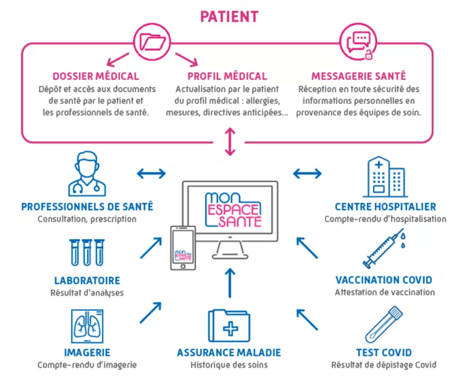
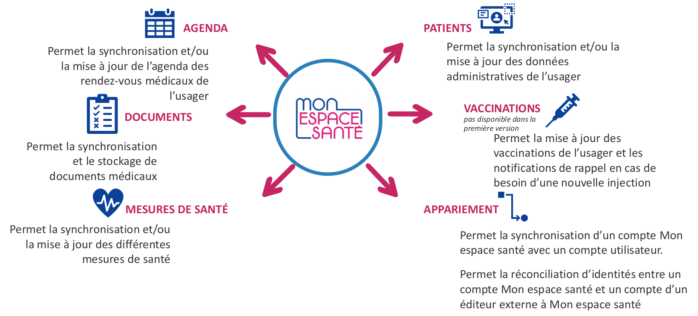

## Qu'est-ce que c'est

* Mon Espace Santé (MES), anciennement appelé l'Espace Numérique de Santé (ENS), est un service initié par le programme Ségur et introduit par la [loi Organisation et Transformation du Système de Santé (OTSS)](https://www.assemblee-nationale.fr/dyn/15/dossiers/organisation_transformation_systeme_sante) du 24 juillet 2019 — article 45

* L'application web Mon Espace Santé permet aux citoyens d'accéder à

  - une **version améliorée du Dossier Médical Partagé (DMP)**  
    Permet à un patient de consulter, stocker et classer ses documents de santé (ordonnance, compte rendu d'hospitalisation, de biologie, etc) et de renseigner son profil médical: antécédents médicaux, vaccinations, allergies, mesures de santé...  
    Mon Espace Santé expose le contenu du DMP, tous les Logiciel de Professionnel de Santé (LPS) compatible DMP ont également accès à ces informations.

    

  - une **messagerie santé**    
    Permet d'échanger avec les professionnels de santé.  
    Les documents reçus via la messagerie patient peuvent être directement enregistrés dans le dossier médical de Mon espace santé.
    L’usager ne peut pas contacter un professionnel de santé s’il n’a pas déjà été contacté par celui-ci.

  - un **agenda**  
    Permet à l'utilisateur de centraliser tous ses rendez-vous médicaux ou événements importants relatifs à sa santé. Il pourra être renseigné par le patient lui-même, ou être mis à jour par des applications ou professionnels de santé

  - un **store**  
    Un catalogue d'applications numériques de santé à destination du grand public.  
    Permet à l'utilisateur de directement partager les données des services (ex doctolib) et appareils (ex glucomètre) qu'il utilise.

* Mon Espace Santé est hébergé en France par Atos

## Les acteurs

- Les **citoyens**  
  Les citoyens alimentent eux même Mon espace santé. Ils donnent accès à leurs données santé

- Les **industriels**  
  Les industriels développent les services référencés dans Mon espace santé — qui devrons respecter les critères de sécurité, d'éthique et de qualité qui s'appliquent

- Les **professionnels de santé**  
  Les professionnels envoient leurs données de santé à leurs patients en utilisant une messagerie MSSanté et en alimentant le DMP

- L'**Etat**  
  L'Etat et l'Assurance Maladie construisent le service. Ils mettent en place les conditions de sécurité et de souveraineté de la plateforme

  

## Catalogue de services référencés

* Chaque utilisateur pourra choisir les services auxquels il veut avoir accès  
  et choisir de manière libre et éclairée les données qu'il accepte d'échanger

* Quelques exemples de services envisagés:

  - Alimentation par des **dispositifs connectés**  
    (poids, tension, glycémie...) en vue de la surveillance d'un patient (diabète par exemple)  

  - Délivrance de **médicaments**,  
    de l'ordonnance jusqu'à la livraison depuis la pharmacie par un service spécialisé

  - Parcours patients avec tous les **rendez-vous**  
    qui alimentent l'agenda du patient

  - Consultation de tous les **documents**  
    d'hospitalisation au travers d'un portail

  - Services numériques de **prévention**  
    et de bien-être (alimentation, activité physique...)

## Se faire référencer

* Référencer son service dans le catalogue Mon Espace Santé permet à une entreprise

  - D'acquérir un **marché**:  
    Être visible par plus de 60 millions de français.  
    Générer du trafic et des usages pour le service avec l'acquisition de nouveaux clients

  - Matérialiser son **engagement**:  
    Respecter le cadre fixé par la Puissance Publique.  
    Garantir aux citoyens que les applications et services sont développés dans un cadre éthique et sécurisé, au travers du processus de référencement

  - Échanger des **données**:  
    Accès en lecture et écriture aux données de l'espace santé de chaque citoyen qui y aura consenti.  
    Fidéliser les citoyens qui utilisent le service, créer de nouveaux usages avec le consentement des patients aux travers des données collectées

  

  Source:  
  [Entrepreneur, je découvre Mon espace santé (vidéo)](https://esante.gouv.fr/webinaires/reussir-ensemble-mon-espace-sante-start-entrepreneurs)

* Il existe deux types de procédures de référencement:

  - un **référencement simple**.  
    La solution est publiée sur le Catalogue de services référencés sans échanger de données avec Mon espace santé.  
    <ins>Exemple</ins>: Application ou site internet proposant des exercices de renforcement musculaire et d’étirement pour la santé du dos

  - un **référencement avec échange de données**.  
    La solution échange des données / documents avec Mon espace santé, en lecture ou écriture ou les deux. Une application avec échange de données qui souhaiterait se faire référencer aura davantage de critères de conformité à respecter.  
    <ins>Exemple</ins>: Application de suivi des mesures de santé (poids, tension…) dont les données se synchronisent avec Mon Espace Santé afin de suivre ou déceler des pathologies (prise de poids excessive, obésité, etc.).

    

* Pour publier un service sur le catalogue Mon Espace Santé:

  1. **Éligibilité**:  
      Vérifier les critères d'éligibilité

      - Votre solution numérique est une application mobile et/ou un site web
      - Éditée par un acteur public ou privé
      - Qui s’adresse aux particuliers (patients, citoyens, usagers). Une application à destination pro sera plutôt dans le bouquet de services pro — qui viendra plus tard
      - Concerne la santé, le bien-être ou le maintien de l’autonomie
      - Est reliée ou non à un ou plusieurs objets connectés
      - Utilise ou non un dispositif médical
      - Est gratuite ou non

      Notons que le processus de référencement est national. Les services qui n'ont qu'une portée régionale passerons par le référencement national, et à termes des filtres permettrons de sélectionner les services dans une région

      Source: [Vérifier si vous êtes concernés](https://gnius.esante.gouv.fr/fr/le-parcours-guide-mon-espace-sante/je-verifie-si-mon-service-numerique-est-concerne)

  2. **Démarrage**:  
      Consulter la documentation sur le site du GIE SESAM-Vitale Espace Industriels  
      et sur le site du G_NIUS (Guichet National de L'innovation et des Usages en e-Santé)

     - [Le guide du référencement (consulter le guide)](https://editeurs.monespacesante.fr/)  
     - [La doctrine du numérique en santé (accédez à la doctrine)](https://gnius.esante.gouv.fr/fr/le-parcours-guide-mon-espace-sante/jidentifie-si-ma-solution-echange-avec-mon-espace-sante/ma-roadmap-mon-espace-sante-avec-echange/jevalue-ma-conformite-a-la-doctrine-technique-le-portail-convergence)  
     - [Documentation spécifique aux échanges de données](https://editeurs.monespacesante.fr/)
     - En cas de difficultés, contacter centre-de-service@sesam-vitale.fr

      Source:  
      [Le parcours guidé](https://gnius.esante.gouv.fr/fr/le-parcours-guide-mon-espace-sante/jidentifie-si-ma-solution-echange-avec-mon-espace-sante/ma-roadmap-mon-espace-sante-avec-echange)

      Liens:  
      [Guide du référencement v3.8](https://cms.monespacesante.fr/gateway/cms/sites/default/files/Guide%20du%20re%CC%81fe%CC%81rencement%20a%CC%80%20Mon%20espace%20sante%CC%81_v3.8.pdf)  
      [Cadre d’interopérabilité des systèmes d’information de santé (CI-SIS): doctrine 2021](https://esante.gouv.fr/sites/default/files/media_entity/documents/CI-SIS_DOCTRINE_20210803_V1.1.pdf)  
      [Doctrine du numérique en santé 2022](https://esante.gouv.fr/sites/default/files/media_entity/documents/doctrine-du-numerique-en-sante_version-2022_vf.pdf)  
      [Doctrine du numérique en santé 2023](https://esante.gouv.fr/sites/default/files/media_entity/documents/doctrine_2023_page-a-page_vf.pdf)

  3. **Conformité**:   
      Vérifier la conformité des produits aux critères de la doctrine du numérique en santé et télécharger les preuves éthiques: créer un compte sur Convergence, emprunter le parcours "référencement mon espace santé" et répondre aux questionnaires.  

      Liens:  
     [Je me connecte à mon compte Convergence](https://gnius.esante.gouv.fr/fr/le-parcours-guide-mon-espace-sante/jidentifie-si-ma-solution-echange-avec-mon-espace-sante/ma-roadmap-mon-espace-sante-avec-echange/jevalue-ma-conformite-a-la-doctrine-technique-le-portail-convergence)   
      [Référencement mon espace santé sur le site Convergence](https://convergence.esante.gouv.fr/mon-espace-sante/referencement-guide/)  
      [Le guide pas à pas Mon espace santé sur Convergence](https://convergence.esante.gouv.fr/pictures/publish/53)

  4. **Phase de référencement**:  
      Déposer une candidature de référencement pour entrer en contact avec le GIE et entrer dans la partie opérationnelle du référencement. Notons qu'au moment du dépot de la demande de référencement, le service doit être utilisable, il ne s'agit pas de référencer des promesses ou des roadmap mais d'apporter des services aux utilisateurs. Des preuves seront demandées, sur la partie éthique et sécurité des échanges de données.

      Lien: [Référencer un service sur le catalogue](https://editeurs.monespacesante.fr/)

       

  4. **Publication**:  
      Une fois publié, le référencement initial est valable pour 1 an. Si le renouvellement du référencement est accepté, le référencement sera valable pour une période de 2 ans supplémentaires, soit un total de 3 ans.  
       Les services référencés doivent mettre à jour leur déclaration de conformité en cas de changement de version majeure. Des audits aléatoires sont menés pour vérifier les déclarations de conformité des éditeurs.

## Échange de données: les APIs

* Il y aura 6 APIs (standard FHIR) pour échanger des données avec Mon espace santé:

  - appariement
  - mesures de santé
  - documents
  - agenda
  - données patient
  - vaccination

* L'**appariement** est une API socle:  
  Un appariement entre le service et Mon espace santé sera nécessaire pour synchroniser des données d'un compte Mon espace santé avec un compte utilisateur externe, et ainsi permettre au service d'échanger des données, et interagir de manière fluide et sécurisée avec les documents et l’agenda de Mon espace santé. L'appariement consiste à relier
  - l'identifiant utilisateur Mon espace santé de l'usager
  - et l'identifiant Externe de l'usager dans le service référencé

* Les APIs d'**échanges de données** sont autorisées suivant l'usage:  
  L'utilisation de chaque API devra être justifié et apporter une véritable valeur ajoutée à l'utilisateur.  
  L'utilisateur devra donner son consentement et saura quel type de données sont échangées

