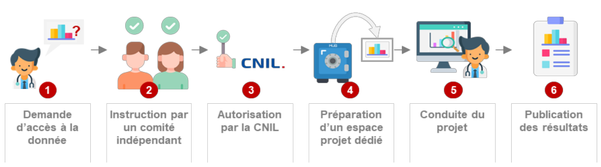

## Qu'est-ce que c'est

* La Plateforme des Données de Santé (PDS), également appelée Health Data Hub, peut faire référence

  - à la **solution technique**:  
    Une plateforme permettant notamment le stockage et la mise à disposition de données de santé.  
    L'objectif est de permettre aux porteurs de projet d'accéder à des données non nominatives accessibles sur une plateforme sécurisée.  
    Créée le 30 novembre 2019, par arrêté du 29 novembre 2019.

  - au **Groupement d’Intérêt Public (GIP)**:  
    Une structure qui associe [56 parties prenantes](https://www.legifrance.gouv.fr/jorf/id/JORFTEXT000039433105), en grande majorité issues de la puissance publique (CNAM, CNRS, Haute Autorité de santé, France Assos Santé, ...), chargée de la mise en place et de l’administration de la plateforme

* La plateforme est destinée à faciliter le partage des données de santé issues de sources très variées,  
  pour favoriser les études, recherches ou évaluation présentant un caractère d’intérêt public  
  et contribuant à l’une des finalités suivantes:

  - information sur la santé
  - mise en œuvre des politiques de santé
  - connaissance des dépenses de santé
  - information des professionnels et des établissements sur leurs activités
  - innovation dans les domaines de la santé et prise en charge médico-sociale
  - surveillance, veille et sécurité sanitaire

## Bases de données

* La Plateforme des Données de Santé est constituée de différentes bases de données:

  - le **Système National des Données de Santé (SNDS) principal**  
    La plateforme est chargée de stocker et mettre à disposition les données de la base principale du SNDS, conjointement avec la Caisse nationale d’assurance maladie (CNAM).
    Cette base rassemble et met à disposition des bases de données qui existaient jusqu’alors indépendamment:

    - La base SNIIRAM: contient les données de l’assurance maladie
    - La base PMSI: contient les données issues de l’activité des établissements de santé
    - La base CepiDC (gérée par l’INSERM): contient les données sur les causes de décès
    - Les données liées au handicap issues des maisons départementales des personnes handicapées
    - Des données provenant des « complémentaires santé » (mutuelles par exemple)

  - le **catalogue du SNDS**  
    La plateforme est également responsable des bases de données inscrites au "catalogue du SNDS", qui sont des bases de données publiques ou privées présentant un intérêt particulier pour la recherche, par exemple les résumés de passage aux urgences.

    Initialement composé des données médico-administratives telles que les feuilles de soin, la facturation hospitalière et les causes médicales de décès, le SNDS a été élargi par la loi OTSS du 24 juillet 2019 à toutes les données de santé qui bénéficient d'un financement de la solidarité nationale dans le but d’élargir le patrimoine des données disponibles et de contribuer ainsi à une utilisation plus large des données. Le SNDS comprend donc désormais des données de registres, de cohortes de recherche, d’entrepôts de données hospitalières, etc.

    Exemple de bases de données pressenties:

    - <ins>Le Système National des Données de Santé (SNDS) “historique”</ins>  
      Données issues des feuilles de soin, de la facturation hospitalière et des causes médicales de décès (Assurance Maladie)
  
    - <ins>La base OSCOUR</ins>  
      Base relative aux passages aux urgences en France (Santé Publique France)

    - <ins>Registre France Greffe de Moëlle</ins>  
      Base de données permettant d’étudier le parcours de soin entre l’annonce du don et le don de moëlle (Agence de Biomédecine)

    - <ins>Base de 500 000 angioplasties</ins>  
      Base de données issues de différents centres et permettant d’évaluer l’impact des stents dans la vie réelle (Société Française de cardiologie)

    - <ins>La cohorte I-share</ins>  
      Base permettant d’analyser la santé des étudiants (Université de Bordeaux)

    Le contenu du catalogue sera décrit sur le site internet du Health Data Hub,  
    ainsi que l’ensemble des projets qui seront réalisés grâce à lui.

  - des **bases de données de recherche**  
    Elle rassemblera des copies de bases déjà existantes, dans lesquelles les informations personnelles identifiantes auront été supprimées. Cette collection de bases sera construite de manière progressive et itérative, en partenariat avec les producteurs des données concernées

    Ainsi, une partie des données de santé enregistrées chez un médecin, pharmacien ou à l’hôpital, peuvent être transmises à des chercheurs et des professionnels de santé. Les données utilisées par les chercheurs sont reliées à un même numéro pour ne pas identifier directement le patient et ne contiennent pas les noms, prénoms, numéros de sécurité sociale ou coordonnées (adresse postale, téléphone)

- Notons que la plateforme du Health Data Hub n’est pas exclusive, d’autres acteurs peuvent proposer des plateformes technologiques pour le traitement des données, la Caisse Nationale de l’Assurance Maladie, par exemple, sur un périmètre plus restreint de données ou certains établissements hospitaliers

Source:  
[Health Data Hub](https://www.health-data-hub.fr/citoyen)  
[Plateforme des données de santé : missions et enjeux](https://www.cnil.fr/fr/plateforme-des-donnees-de-sante-missions-et-enjeux)  
[SNDS : Système National des Données de Santé](https://www.cnil.fr/fr/snds-systeme-national-des-donnees-de-sante)  
[Qu’est-ce que le SNDS ?](https://www.snds.gouv.fr/SNDS/Qu-est-ce-que-le-SNDS)

## Accès aux données

1. **Demande d'accès à la donné**  
   Toute personne ou structure, publique ou privée, à but lucratif ou non lucratif, qui souhaite réaliser une étude, une recherche ou une évaluation présentant un intérêt public via l'accès aux données du Health Data Hub, formule une demande d’accès et peut être accompagnée dans la démarche

2. **Intruction par un comité indépendant**  
   La demande est transmise à un Comité scientifique et éthique indépendant. Il vérifie que l’objet de l’étude est pertinent et d’intérêt général, que les données demandées sont en adéquation avec ce projet et que la méthodologie proposée est robuste

3. **Autorisation par la CNIL**  
   La CNIL est saisie sur la base de ces éléments pour donner son autorisation au lancement du projet

4. **Préparation d'un espace projet dédié**  
   L’autorisation de la CNIL obtenue, l’équipe du Health Data Hub consolide les données requises et prépare sur sa plateforme technologique un "espace projet" sécurisé, qui ne contient que les données nécessaires

5. **Conduite du projet**  
   Les utilisateurs de la plateforme technologique ont accès à leur "espace projet" à distance, et traitent les données sur la plateforme sans pouvoir les récupérer. Le Health Data Hub peut facturer l’accès à ses services

6. **Publication des résultats**  
   Les résultats du projet sont rendus publics sur le site internet du Health Data Hub, dans le respect de la compétitivité académique et industrielle

## Espace Européen des Données de Santé (EHDS)

* L'Espace Européen des Données de Santé (EHDS), dévoilé mardi 3 mai 2022 par la Commission européenne, est un projet de règlement pour le partage des données de santé en Europe.

  Le partage de données à l’échelle européenne permet, par exemple, de construire des algorithmes plus performants au service de la recherche ou de la performance industrielle, d’améliorer la gestion de pandémies telles que celle due à la COVID-19 ou encore d'étudier des maladies rares grâce à la mutualisation des données.

* Le projet de règlement propose aussi un cadre pour l’utilisation transfrontière des données de santé avec la mise en place d’une infrastructure européenne “HealthData@EU” et guide les acteurs afin de faciliter l’identification et la réutilisation des données au niveau européen. Enfin, le texte prévoit la mise en place d’une gouvernance européenne, à travers la création d’un “European Health Data Space Board”.
