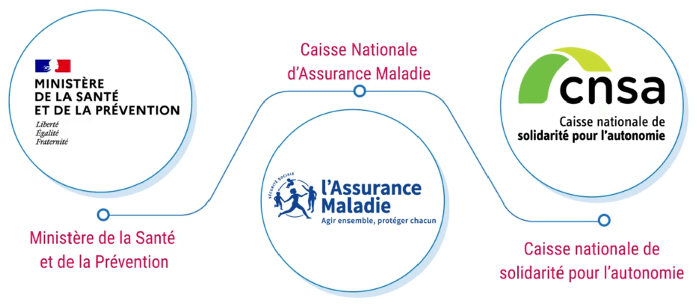
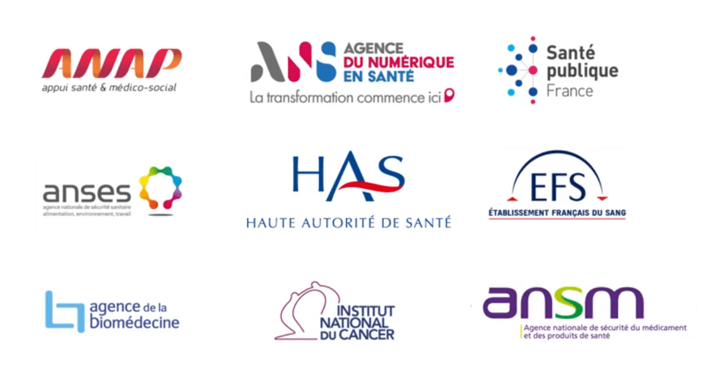
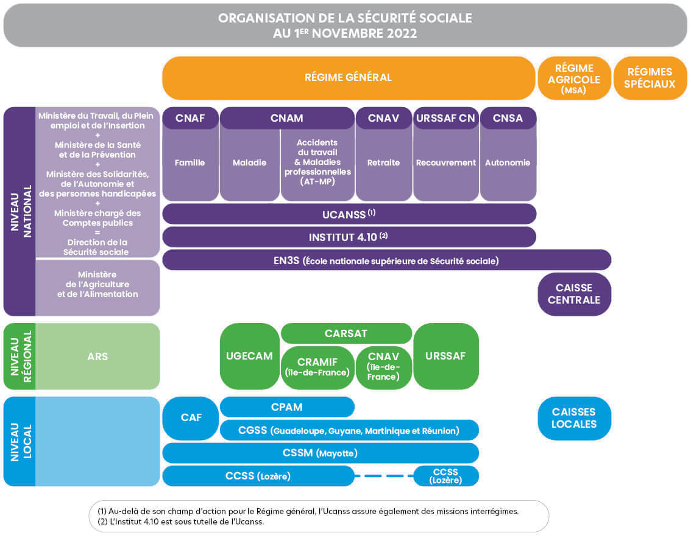

## Ministère et institutions publiques

La politique nationale de santé est définie par

- le <ins>**Ministère de la Santé et de la Prévention**</ins>  
  Définit la stratégie nationale à suivre dans les domaines de  
  la santé publique, l'organisation du système de santé et la protection sociale.  
  Les services du ministère sont répartis en 6 grandes directions organisées en missions:

  - la Direction Générale de la Santé (DGS)
  - la Direction Générale de l'Offre de Soins (DGOS)
  - la Direction de la Sécurité Sociale (DSS)
  - la Délégation ministérielle au Numérique en Santé (DNS)
  - la Direction Générale de la Cohésion Sociale (DGCS)
  - la Direction de la Recherche, des Études, de l'Évaluation et des Statistiques (Drees)

- la <ins>**Caisse Nationale d'Assurance Maladie (CNAM)**</ins>  
  L'Assurance Maladie, incarnée par la Caisse Nationale d'Assurance Maladie (CNAM), est un des organismes de la Sécurité sociale, qui veille au respect de l'objectif national de dépense d'assurance maladie et à l'efficacité du système de soins.  
  Elle coordonne et organise l'action des organismes de son réseau, avec notamment

  - les Caisses Primaires de l'Assurance Maladie (CPAM)
  - les Caisses Générales de Sécurité Sociale (CGSS) dans les Départements et Régions d'Outre-Mer (DROM)
  - la Complémentaire Santé Solidaire (CSS)
  - les Directions Régionales du Service Médical (DRSM)
  - les Caisses d’Assurance Retraite et de la Santé au Travail (Carsat)
  - les Unions de Gestion des Établissements de Caisse d’Assurance Maladie (Ugecam)

  La CNAM est fortemment positionnée sur les services numériques avec
  - le **compte Ameli**: démarches médicales administratives des assurés
  - **ameliPro**: démarches médicales administratives des professionnels de santé
  - **Mon Espace Santé**: carnet de santé numérique des assurés
  - **data.ameli**: site de data visualisation
  - la **e-prescription**: ordonnance numérique
  - l'**apCV**: appli carte Vitale

- la <ins>**Caisse Nationale de Solidarité pour l'Autonomie (CNSA)**</ins>  
  Soutient l'autonomie des personnes agées et handicapées.  
  Elle conçoit et met en oeuvre différents Systèmes d'Information (SI):

  - **SI-MDPH (SI des Maisons Départementales de Personnes Handicapées)**  
    Équippe les Maisons Départementales de Personnes Handicapée (MDPH)

  - **SI-APA (SI de l'Allocation Personnalisée d'Autonomie)**  
    Équippe les équipes départementales chargées de la gestion de l'Allocation Personnalisée d'Autonomie (APA) à domicile et permet aux personnes agées de déposer leurs demandes 

  - **SIDOBA (SI De l'Offre de la Branche Autonomie)**  
    Permet de renforcer la connaissance et le pilotage de la branche autonomie grâce aux données

  Sous le nom *service publique de l'autonomie*, la CNSA met à disposition les sites d'information

  - **pour-les-personnes-agees.gouv.fr**:  
    pour les personnes agées

  - **monparcourshandicap.gouv.fr**:  
    pour les personnes en situation de handicap et leurs proches

## Agences et opérateurs nationaux

Le Ministère de la Santé, la CNAM, et la CNSA s’appuient sur des agences et opérateurs nationaux pour mettre en œuvre la politique nationale de santé:

- l'<ins>**Agence du Numérique en Santé (ANS)**</ins>  
  Agence sous la responsabilité du Ministère de la santé et de la prévention,    
  l'ANS s'occupe entre autres de
  - Publier des référentiels et guides d'implémentation,  
    dont le Cadre d'Interopérabilité des Systèmes d'Information de Santé (CI-SIS)
  - Opérer les référentiels et services socles qui permettent l'authentification des professionnels:  
    l'annuaire santé, cartes CPS et e-CPS, Pro Santé Connect

- le <ins>**GIE (Groupement expert des systèmes d'Information des professionnels et Établissements de santé) SESAM-Vitale (Système Électronique de Saisie de l'Assurance Maladie)**</ins>  
  Est un opérateur privé qui accompagne les éditeurs de services numériques en santé, de l'implémentation jusqu'au déploiement, tout en assurant le support technique. Il a également la responsabilité de
  - Créer et délivrer les cartes Vitale et Cartes Européennes d’Assurance Maladie (CEAM)
  - Développer de l'application carte vitale (apCV)
  - Assurer la dématérialisation des feuilles de soin
  - Référencer des services au catalogue de Mon Espace Santé

- le <ins>**Centre National de Dépots et d'Aggréments (CNDA)**</ins>  
  Teste et certifie les logiciels

- l'<ins>**Agence Nationale de Sécurité du Médicament et des produits de santé (ANSM)**</ins>  
  Agence sous la tutelle du Ministère de la santé,
  financée par le budget de la Sécurité sociale et ses ressources propres.  
  L'ANSM assure la sécurité des produits de santé et des médicaments avant et après leur mise en vente sur le marché, à travers les différents rôles qu'elle occupe:
  - Autoriser la mise sur le marché des médicaments et des produits biologiques
  - Surveiller les produits de santé tout au long de leur cycle de vie
  - Étudier les impacts de leur utilisation
  - Recueillir et analyser les déclarations d’effets indésirables
  - Contrôler la qualité des produits dans ses laboratoires
  - Inspecter les sites de fabrication et de distribution
  - Prendre des injonctions et sanctions financières à l’encontre des opérateurs en cas de manquement

  L'ANSM est fortemment impliquée dans les travaux européens, en coordination avec l'Agence Européenne des Médicaments, la commission européenne et les autres agences nationales de l'Union européenne. Elle collabore également avec les organismes de santé internationaux

- la <ins>**Haute Autorité de Santé (HAS)**</ins>   
  Autorité administrative indépendante, elle remplit trois grandes fonctions: évaluation, recommandation et certification / accréditation, dans le but de développer la qualité dans le champ sanitaire, social et médico-social.  
  Elle est répartie en plusieurs commissions spécialisés:
    - Stratégies de prise en charge
    - Parcours et pratiques de soin
    - Certification des établissements de santé
    - Transparence: utilité des nouveaux médicaments
    - Évaluation économique et de santé publique
    - Évaluation des dispositifs médicaux, des actes et des technologies de santé (CNEDiMTS)
    - Information du patient et du grand public

- l'<ins>**Agence Nationale de la Sécurité des Systèmes d'Information (ANSSI)**</ins>  
  Placée sous l'autorité du premier ministre et rattachée au Secrétaire Général de la Défense et de la Sécurité Nationale (SGDSN), elle est l'autorité nationale en matière de cybersécurité. Sa mission est de

  - <ins>Défendre</ins>: structurer au niveau national la détection de cyberattaques d'ampleur
    et  
    structurer l'assistance aux victimes
  - <ins>Connaître</ins>: être experte des technologies et des sytèmes d'information,  
    des menaces et risques du cyberespace et développer des méthodes et outils pour y faire face
  - <ins>Partager</ins>: produire des recommandations, solutions et outils de cybersécurité,  
    et particper à la formation les agents de l'État et des opérateurs régulés à la cybersécurité
  - <ins>Accompagner</ins>: déployer une politique publique et une doctrine française de cybersécurité,  
    concevoir des dispositifs normatifs et réglementaires au niveau national et européen

  Un des partenaire de l'ANSSI est le CERT Santé (Computer Emergency Response Team), dimension opérationnelle de la cybersécurité au sein de l’ANS, qui propose un portail de signalement des évènements sanitaires indésirables, et réalise des audits de cyber-surveillance.

- la <ins>**Commission Nationale Informatique & Libertés (CNIL)**</ins>  
  Autorité administrative indépendante française chargée de veiller à la protection des données personnelles.  
  La CNIL a divers rôles:

  - Accompagner et conseiller les professionnels  
    dans leur mise en conformité au Règlement Général sur la Protection des Données (RGPD)

  - Instruire des demandes d'avis sur des projets de lois   
    ou de textes réglementaires adressés par le gouvernement

  - Permettre aux citoyens d'exercer leurs droits, leur assurer l'accès aux données qui les concerne.  
    Toute personne peut s’adresser à la CNIL en cas de difficulté dans l’exercice de ses droits en lui adressant une plainte.

  - Contrôler et sanctionner les organismes en cas de manquement au RGPD.  
    Les sanctions vont de l'avertissement, le rappel aux obligations légale, la mise en demeure (enjoindre l'organisme à se mettre en conformité dans un délai imparti), à la procédure de sanction (financière)

- l'<ins>**Agence Nationale de Sécurité sanitaire de l'alimentation, de l'environnement et du travail (ANSES)**</ins>  
  A pour mission principale d'évaluer les risques sanitaires  
  dans les domaines de l'alimentation, de l'environnement et du travail

## Note sur la Sécurité Sociale

La Sécurité sociale est subdivisée en différents régimes:

- le **régime général** couvre 90% de la population.  
  Il composé de 6 branches

  - la branche **Famille**,  
    gérée par la Caisse Nationale des Allocations Familiales (CNAF)

  - la branche **Maladie**,  
    gérée par la Caisse Nationale d'Assurance Maladie (CNAM)

  - la branche **Accidents du Travail – Maladies Professionnelles (AT/MP)**,  
    également gérée par la CNAM

  - la branche **Retraite**,  
    gérée par la Caisse Nationale d'Assurance Vieillesse (CNAV)

  - la branche **Autonomie**,  
    gérée par la Caisse Nationale de Solidarité pour l'Autonomie (CNSA)

  - la branche **Recouvrement**,  
    gérée par les Unions de Recouvrement des cotisations de Sécurité Sociales et d'Allocations Familiales (URSSAF)

- le **régime agricole** couvre les exploitants et salariés agricoles,  
  Il est unifié à travers la Mutualité Sociale Agricole (MSA), qui assure la gestion des différentes branches

- les **régimes spéciaux** couvre les salariés de certaines grandes entreprises publiques

  

  Source: [Les branches de la sécurité sociale](https://www.securite-sociale.fr/la-secu-cest-quoi/organisation/les-branches)

## Programmes du numérique en santé

La stratégie nationale du numérique en santé est constituée de plusieurs programmes:

- **HOP'EN (Hôpital numérique ouvert sur son environnement)**  
  Vise à assurer une prise en charge de qualité du patient, quel que soit l’établissement de santé.  
  Une des priorités est de renforcer les exigences autour du déploiement des services socles nationaux, de la sécurité des SI, d'une identité patient unique — en intégrant l’Identifiant National de Santé (ISN) — et du respect du Règlement Général sur la Protection des Données (RGPD)

- **Ségur**  
  Vise à généraliser le partage fluide et sécurisé des données de santé  
  entre Professionnels de Santé (PS) et entre PS et citoyens

- **ESMS numérique**  
  Vise à généraliser l’utilisation du numérique dans les Établissements et services Sociaux et Médico-Sociaux (ESMS).  
  Repose principalement sur le déploiement d’un Dossier Usager Informatisé (DUI) pour chaque personne accompagnée.