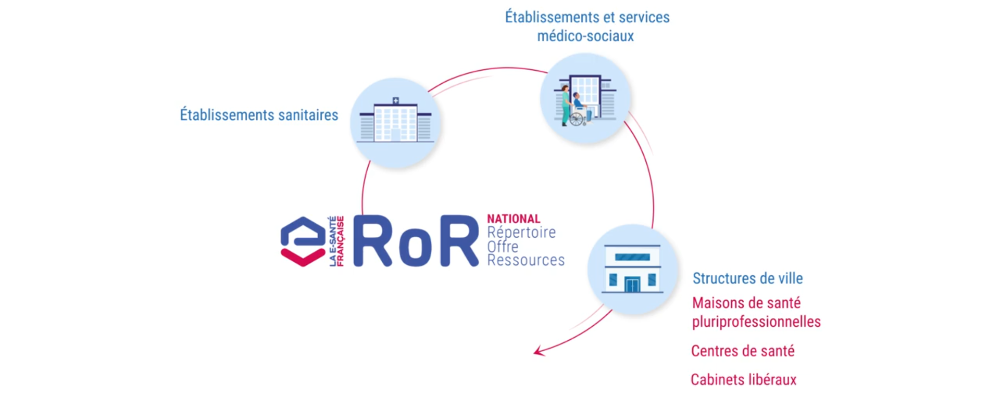

## Qu'est-ce que c'est

* Le Répertoire de l’Offre et des Ressources en santé (ROR) est un référentiel de données qui

  - **Liste l'offre de soin** des structures sanitaires et médico-sociales:  
    équippements, capacité d'acceil et compétences.

    

  - **Utilise un format normalisé** (avec des nomenclatures nationales)  
    permet de facilement rechercher et comparer les structures.

  - **Alimente automatiquement** les services numériques utilisés par les professionnels du secteur.  
    Le ROR alimente les outils métiers des professionnels de santé pour orienter l'usager plus rapidement vers le professionnel ou la structure qui répond le mieux à ses besoins de prise en charge.  
    Plus d'une trentaine de services numériques en santé régionaux ou nationaux sont alimentés, avec pour finalité

      - l’aide à l’orientation (ex: Via trajectoire, Service d’accès aux soins)
      - l’aide à la coordination (ex: Outils de parcours patient)
      - le suivi des tensions hospitalières
      - l’information au grand public (ex: Santé.fr, portail grand public qui utilise les données publiques du ROR)

- Le ROR fournit en priorité l’information sur les lits disponibles dans les services de soins intensifs ou de réanimation, notamment lors des situations de crise.
  En fonction des stratégies des Agences Régionales de Santé (ARS), il peut aussi couvrir d’autres périmètres: hospitalisation à temps complet, maternité, Soins de Suite et Réadaptation (SSR)...

- Le ROR est alimenté par les répertoires nationaux FINESS et RPPS, qui lui transmettent les données d'identification des structures et des professionnels de santé libéraux.  
  Les établissement sanitaires et médico-sociaux, ainsi que les structures de ville et les cabinets libéraux complètent ces données et la description opérationelle de leur offre de santé

## ROR national et régional

* Il a été décidé en 2020 de construire un ROR national pour remplacer les ROR régionaux.  
  Un ROR régional est une partie du référentiel limité à une couverture régionale. Chacune des 18 régions choisit sa propre solution de gestion du ROR en région — il en existe deux: ROR IR et ROR IeSS — et la déploie et la maintient pour proposer à ses utilisateurs un écran de recherche de l’offre régionale, et une recherche d’offre dans les autres régions (recherche interROR).

  Le ROR national prévoit un stockage centralisé des données (base de données unique),  
  alimenté dans un premier temps par les ROR régionaux.

* Le but du ROR national est:

  - D'**orienter** de manière plus pertinente le patient et réduire le temps de recherche de  
    la structure la plus adaptée à ses besoins et localisation
  - **Diminuer le risque de rupture**
    dans sa prise en charge
  - **Améliorer la coordination**
    entre acteurs du parcours de soins et du parcours de vie
  - **Donner de la visibilité**
    sur les lits et places disponibles dans les services de  
    soins (médecine, réanimation) pour mieux orienter

Source:  
[Connaissez-vous le ROR](https://www.linkedin.com/feed/update/urn:li:activity:7270475269583290368/)  
[Le Répertoire ROR](https://esante.gouv.fr/produits-services/repertoire-ror)  
[Guide d’Implémentation FHIR du ROR](https://interop.esante.gouv.fr/ig/fhir/ror/)
