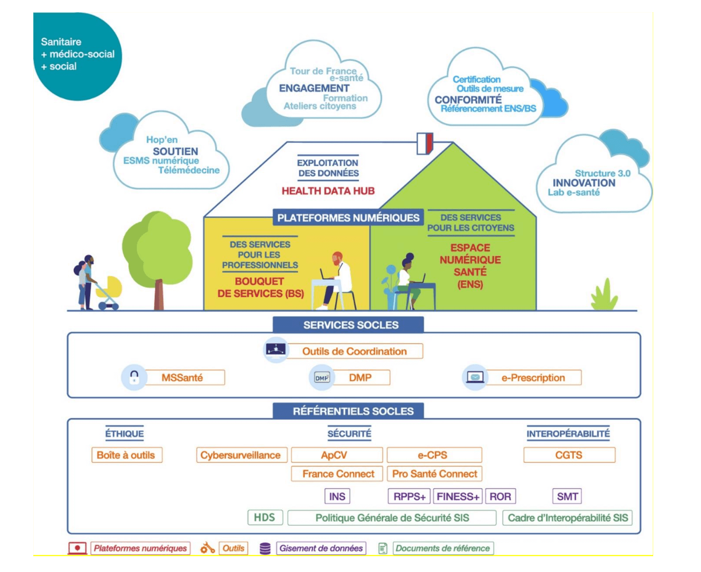
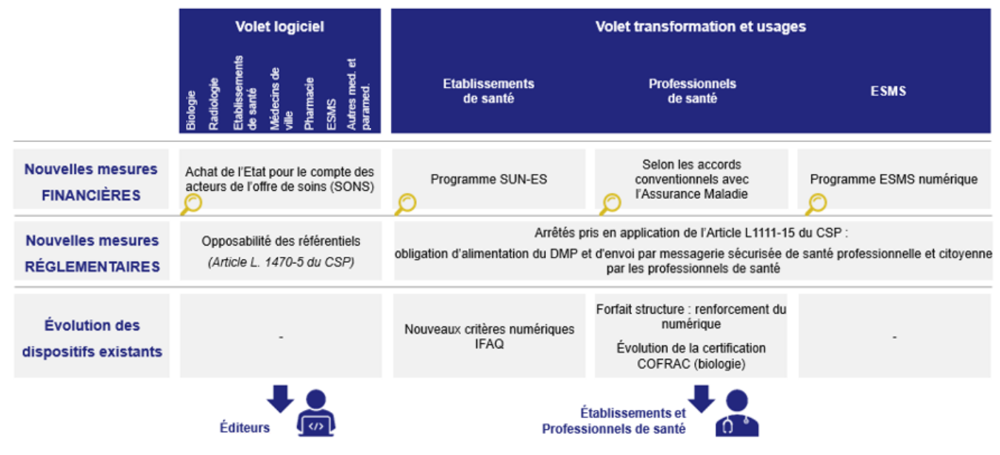
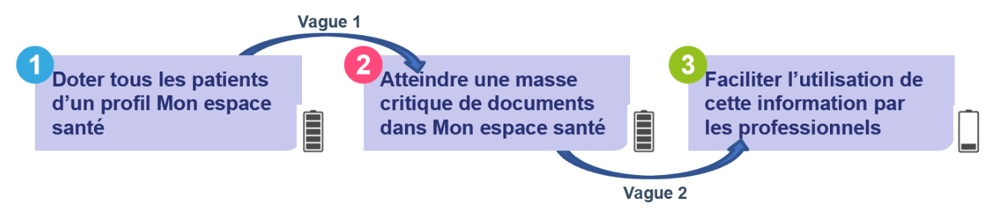

## Doctrine du numérique en santé

* La *doctrine du numérique en santé* est une directive (un document de référence et non une loi ou un décret) pour guider les politiques publiques et les projets liés au numérique en santé, comme par exemple le Ségur de la santé.  
  Établie en 2019 dans le cadre de la feuille de route du numérique en santé par la Direction générale de la santé, elle définit les principes et objectifs pour développer le numérique en santé en France, et vise à encourager l’innovation, la collaboration et l’utilisation responsable des technologies numériques pour améliorer la qualité des soins et la santé de la population. Elle est mis à jour tous les ans

## Le Ségur de la santé

* Le *Ségur de la santé* est un plan d'action lancé le 25 mai 2020 par le gouvernement français, qui s'appuie sur les principes généraux établis par la doctrine du numérique en santé, pour proposer des mesures concrètes et des financements pour mettre en oeuvre ces objectifs.  

* Il inclut des mesures pour répondre aux défis du système de santé, notamment en termes d’accès aux soins, de qualité des soins et de rémunération des professionnels de santé, mais aussi pour favoriser la transformation numérique du système de santé, en mettant en place des solutions de télémédecine, de téléconsultation et d’accès aux données médicales.

* L'origine du nom « Ségur » est l'adresse du ministère de la Santé, avenue de Ségur à Paris.

  

## Task forces & couloirs

* La feuille de route du Ségur de la santé est co-construit par le gouvernement et des groupes de travail, souvent appelés "task force".
  Ces task forces réunissent des professionels de santé, du médico-social et du social, des experts, des directeurs de systèmes d'information, des représentants institutionnels, des fédérations (hôpitaux pubics, hôpitaux privés, industriels, etc) et des éditeurs de logiciels de santé.

* La première concertation s'est déroulée du 25 mai 2020 au 10 juillet 2020, avec pour mission d'identifier les données à échanger ou partager entre les acteurs du domaine

* Un investissement historique de 2 milliards d'euros, financé par le Plan de Relance et de Résilience Européen, a été placé pour accélérer la feuille de route de la transformation numérique. 1,4 milliards sont dédiés à la problématique du partage des données de santé Sanitaire à horizon 3 ans, et 600 millions pour le secteur médico-social à horizon 5 ans.

* Chaque secteur possède ses particularités propres (logiciels, flux de travail, données, organisations), mais le but est de mettre en oeuvre une logique commune à l'ensemble des secteurs d'activité de la santé et du médico-social. Pour y parvenir, les secteurs ont été regroupés en différents "couloirs" qui auront chacun des exigences et des délais assignés:

    - Hôpital
    - Médecine de ville
    - Biologie médicale
    - Imagerie médicale
    - Officine
    - Social et Médico-social
    - Opérateurs MSSanté
    - Service d'accès aux soins (SAS)
    - Sage-femmes, Chirurgiens-dentistes, Paramédical

   cf [Les attendus par couloir (p.18)](https://esante.gouv.fr/sites/default/files/media_entity/documents/Segur_ChantierD_DocCommun_VF.pdf),  
  [Le Ségur du numérique en santé](https://esante.gouv.fr/segur),  
      [Le Ségur du numérique pour les entreprises du numérique en santé](https://industriels.esante.gouv.fr/segur-numerique-sante)

## Urbanisation des systèmes d'information

* Tout part d'un constat simple: la prise en charge des patients est fragmentée. Est en cause un grand nombre d'acteurs, structures et systèmes d'information qui ne communiquent pas entre eux. Pour y remédier, les pouvoirs publics proposent de s'inspirer du mode de gouvernance d'une ville:

  - construire les règles  
    Ex: le code de la route, le code de l'urbanisme

  - développer des infrastructures de base qui permettent les échanges  
    Ex: les routes, les ponts, le réseau des eaux usées

  - laisser l'écosystème créer les infrastructures individuelles à destination des citoyens  
    Ex: les maisons

  - vérifier que les infrastructures respectent les règles  
    et se raccordent aux infrastructures de base

  Et donc d'*urbaniser* les systèmes d'information en santé.
  Chaque système d'information dédié à la santé (qu'on pourra comparer à une maison) devra respecter les mêmes règles et utiliser les mêmes services, en se raccordant aux socles nationaux, pour assurer des fonctionnalités de base identiques et permettre aux professionnels de santé de facilement changer de logiciel, exporter ou partager des données, ou aux patients de changer de professionnel sans perte d'information et perte de qualité de soin

* La doctrine du numérique en santé décrit le cadre technique et d'urbanisation dans lequel les diférents services numériques d’échange et de partage de données de santé doivent s'inscrire

  * Deux socles sont utilisés pour créer des fondations solides:

    - les <ins>référentiels socles</ins>,  
      sont les règles à respecter. Elles s'articulent autour de 3 pilliers: éthique, sécurité et interopérabilité.  
      Constitué d'un ensemble de documents de référence et de gisements de données, tous les services numériques de santé disposent de règles et fondations communes — par exemple, les médecins s'identifient en utilisant leur carte CPS ou e-CPS via Pro Santé Connect

    - les <ins>services socles</ins> (aussi appelés *communs numériques*):  
      sont les infrastructures de base, des services maintenus par des agences et opérateurs nationaux — par exemple des messageries sécurisées de santé (MSSanté)

  * L'État lui-même, via les agences et opérateurs nationaux, construit des plateformes numériques nationales, "une maison" constituée de 3 étages:

    - <ins>Mon Espace Santé (MES)</ins>, auparavant appelé l'<ins>Espace Numérique en Santé (ENS)</ins>  
      Plateforme numérique à destination des citoyens.  
      Pour permettre aux citoyens d'accéder à leurs données médicales et d'accèder à divers services de santé — agenda, messagerie, store d'applications

    - <ins>le bouquet de service pro</ins>,  
      Plateforme numérique à destination des professionnels du sanitaire, du médico-social et du social.  
      Pour simplifier l'accès aux différents services numériques et rendre leurs offres plus lisibles, via un store d'applications qui
      référence les applications (privées ou publiques) qui respectent les règles de la doctrine technique.

    - <ins>la Plateforme des données de santé (PDS)</ins>, aussi appelé le Health Data Hub  
      Plateforme numérique à destination de la recherche.  
      Pour favoriser l’analyse des données à grande échelle qui bénéficient à tous,  
      en facilitant l’accès aux données de santé à des projets d’intérêt général innovants. 

  * Enfin on trouve "des nuages", différents dispositifs d'accompagnement et de stimulation de l'écosystème

  

## Vagues

* La "vague 1" du programme Ségur s'est concentrée sur l'alimentation de Mon espace santé, avec

    1. l'engagement des entreprises et éditeurs de Logiciels de Professionels de Santé (LPS) pour rendre conforme les logiciels

        - des médecins de ville:  
          LGC (Logiciel de Gestion de Cabinet)

        - des établissements de santé:  
          DPI (Dossier Patient Informatisé) et PFI (Plateforme d'Intermédiation)

        - des biologistes médicales:  
          SGL (Système de Gestion pour les Laboratoires)

        - des radiologues et médecins nucléaires:  
          RIS (Systèmes d'Information Radiologiques)

        - et des officines de ville:  
          LGO (Logiciel de Gestion d'Officine)  

    2. la mise en place divers moyens de financement par l'Etat. Le plus connu est le Système Ouvert et Non Sélectif (SONS), qui permet aux établissements ou professionnels de santé de financer directement les éditeurs pour une prestation de passage à une solution disposant d'une référencement "Ségur".  
        Cf [Leviers de financement pour atteindre les objectifs de la feuille de route numérique (p.11)](https://esante.gouv.fr/sites/default/files/media_entity/documents/Segur_ChantierD_DocCommun_VF.pdf)

        

* La "vague 2" vient enrichir ce premier socle pour

    - faciliter la consultation de Mon espace santé pour les professionnels
    - faciliter l’intégration des documents reçus par MSSanté
    - renforcer la sécurité des logiciels
    - étendre le périmètre du Ségur à de nouveaux types de logiciel

        - les logiciels de diffusion des images médicales (DRIMbox)
        - les logiciels des sages-femmes (LGC SF)
        - des chirurgiens-dentistes (LGC CD)
        - et des paramédicaux (LGC P)

<!--
## Acteurs institutionnels

* La **Délégation ministérielle au Numérique en Santé (DNS)**  
  assure le pilotage de l'ensemble des chantiers

* L'**Agence de Numérique en Santé (ANS)**  
  pose les cadres et bonnes pratiques,   
  pilote la production du corpus documentation,  
  accompagne l'ensemble des acteurs et structures de santé,  
  accompagne les établissement dans le domaine de la cybersécurité,  
  est opérateur de services numériques,  
  s'occupe de promouvoir et valoriser les initiatives en e-santé

* La **Direction de l'Hospitalisation et de l'Organisation (DHOS)**  
  est associé à la DNS, notamment pour définir le contenu du cadre de financement à destination des étabissements de santé, désigné par le terme programme SUN-ES (Ségur Usage Numérique en Établissement de Santé)

* La **Caisse Nationale de l'Assurance Maladie (CNAM)**  
  participe à la définition et à la mise en oeuvre des accords "conventionnels" avec les différents syndicats, vise à promouvoir l'équipement et l'usage des outils numériques dans la domaine de la santé

* L'**Agence Nationale d'Appui à la Performance (ANAP)**  
  anime et développe un réseau de professionnels pour mener des actions qui répondent aux besoins des établissements sanitaires et médico-sociaux — fournir des méthodes, outils, événements, interventions

* La **Caisse Nationale de Solidarité pour l'Autonomie (CNSA)**  
  est une branche de la sécurité sociale qui articule les financements à destination des établissements & services médico-sociaux et des industriels du secteur, et est chargée de veiller à l'équilibre financier de cette branche

* Les **Agences Régionales de Santé (ARS)**  
  sont chargées du pilotage régional d'e-santé et d'organiser sa mise en oeuvre

* Les **Groupements Régionaux d'Appuis au Développement de l'e-Santé (GRADeS)**  
  sont les opérateurs préférentiels des ARS, pour animer et fédérer les acteurs de la région
-->