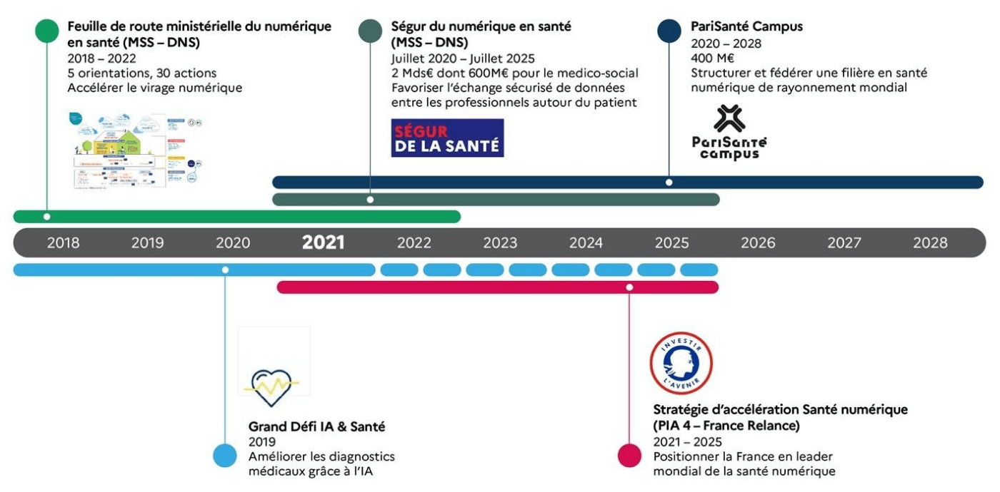
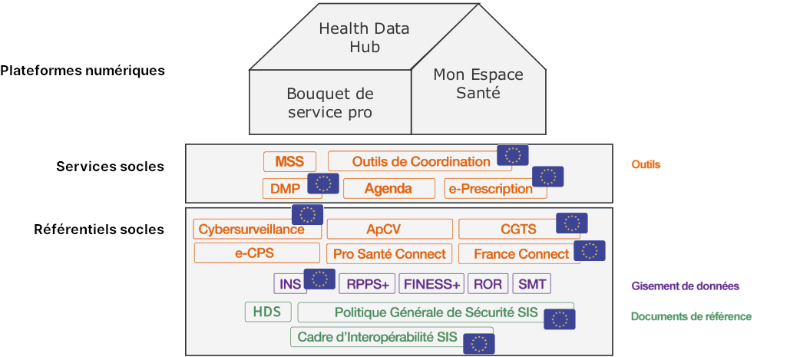
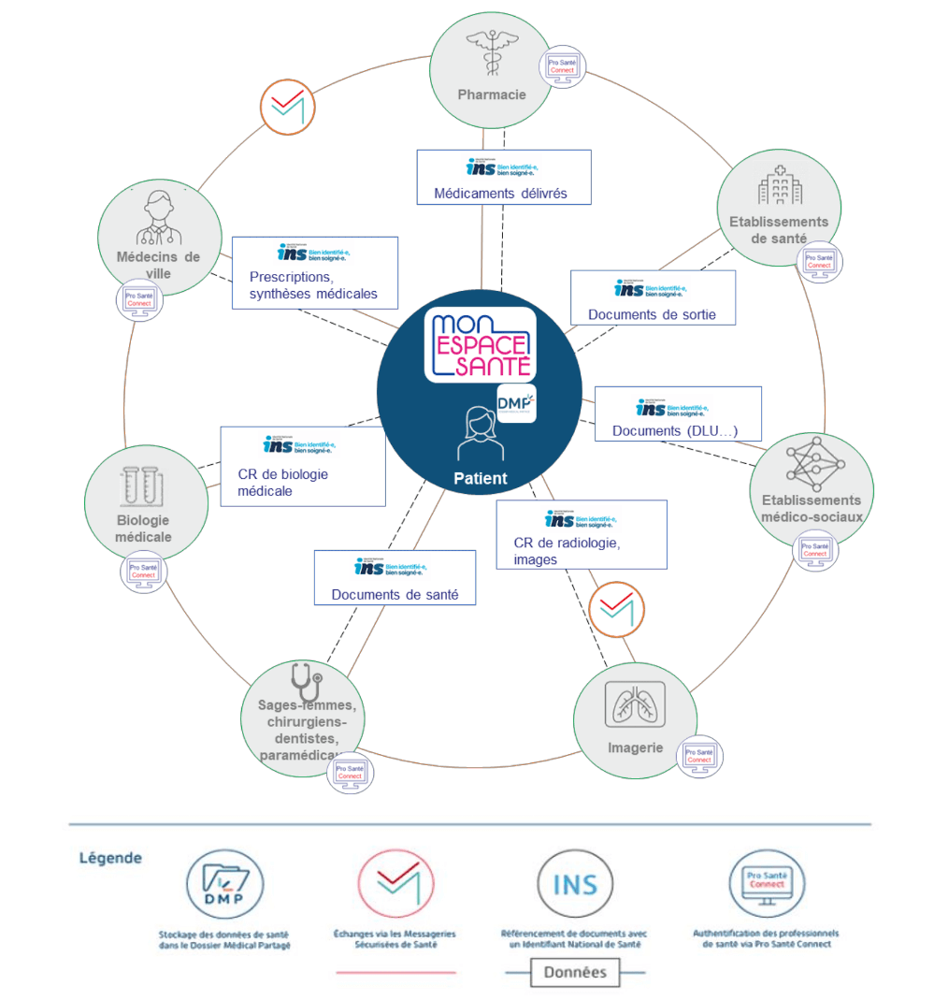
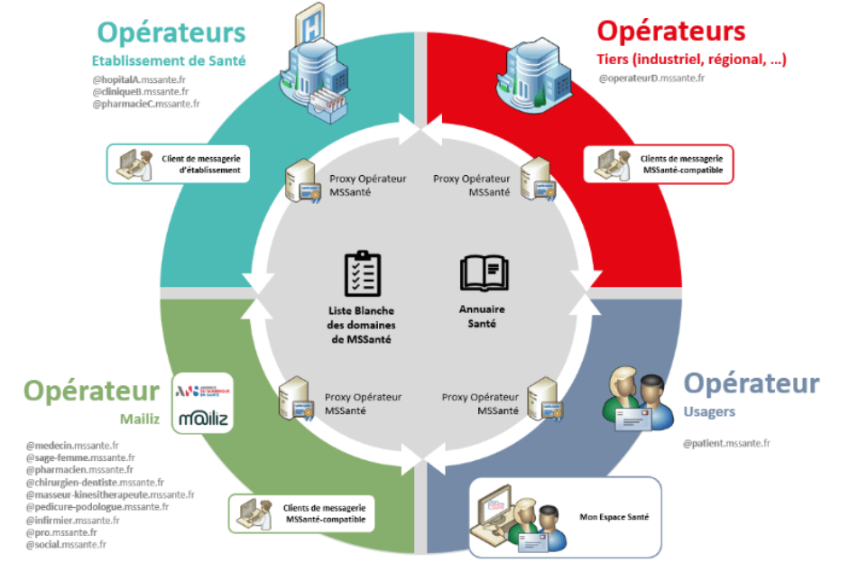
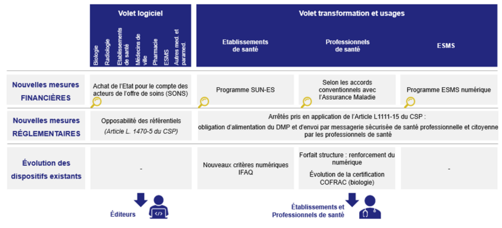

## Qu'est-ce que c'est

* Le ségur du numérique est un programme national, initié par le ministère des Solidarités et de la Santé en 2020,  
  qui a pour objectif de mettre le numérique au service de la santé.  
  L'origine du nom « Ségur » est l'adresse du ministère de la Santé, avenue de Ségur à Paris.

  

## Task forces & couloirs

* L'Etat a fait le choix de s'appuyer sur des "task force" pour co-construire une feuille de route.  
  Ces task forces réunissent des professionels de santé, du médico-social et du social, des experts, des directeurs de systèmes d'information, des représentants institutionnels, des fédérations (hôpitaux pubics, hôpitaux privés, industriels, etc) et des éditeurs de logiciels de santé.

* La première consultation s'est déroulée du 25 mai 2020 au 10 juillet 2020, avec pour mission d'identifier les données à échanger ou partager entre les acteurs du domaine

* Chaque secteur possède ses particularités propres (logiciels, flux de travail, données, organisations), mais le but est de mettre en oeuvre une logique commune à l'ensemble des secteurs d'activité de la santé et du médico-social. Pour parvenir à ce but, les secteurs ont été regroupés en différents "couloir", qui aurons chacun des exigences et des délais assignés:

    - Hôpital
    - Médecine de ville
    - Biologie médicale
    - Imagerie médicale
    - Officine
    - Social et Médico-social
    - Opérateurs MSSanté
    - Service d'accès aux soins (SAS)
    - Sage-femmes, Chirurgiens-dentistes, Paramédical

   cf [Les attendus par couloir (p.18)](https://esante.gouv.fr/sites/default/files/media_entity/documents/Segur_ChantierD_DocCommun_VF.pdf),  
  [Le Ségur du numérique en santé](https://esante.gouv.fr/segur),  
      [Le Ségur du numérique pour les entreprises du numérique en santé](https://industriels.esante.gouv.fr/segur-numerique-sante),  

## Plateformes

* 3 grandes plateformes bénéficierons de la centralisation des données via des services nationaux:

    - <ins>Mon Espace Santé (MES)</ins>,  
      à destination des citoyens

    - <ins>le bouquet de service pro</ins>,  
      à destination des professionnels du sanitaire, du médico-social et du social.   
      Avec dans un premier temps les Logiciels de Professionels de Santé (LPS)

    - <ins>la Plateforme des données de santé (PDS)</ins>, aussi appelé le Health Data Hub  
      à destination de la recherche

    

## Services & réfentiels socles

* Six référentiels et services socles ont été identifiés par l'ensemble des task forces comme nécessaires à l'objectif l'échange et le partage fluide et sécurisé des données de santé:

    - l'[Identité Nationale de Santé (INS)](https://industriels.esante.gouv.fr/produits-et-services/referentiel-ins)  
      Référentiel partagé par l'ensemble des professionnels de santé, visant à fiabiliser l'identité numérique des usagers.  
      L’INS est composée d’un numéro – le matricule INS – et de 5 traits d’identités issus des bases de référence de l’Etat-Civil: nom de naissance, prénom(s) de naissance, date de naissance, sexe et code du lieu de naissance de l’usager. 

    - [Pro Santé Connect (PSC)](https://industriels.esante.gouv.fr/produits-et-services/pro-sante-connect)  
      Service développé et maintenu par l'Agence du Numérique en Santé (ANS) qui permet aux professionnels de santé recensés dans l’Annuaire Santé de s'identifier (via le protocole OpenID) avec leur Cartes de Professionnels de Santé (CPS) ou l'appli e-CPS.

    - la [Messagerie Sécurisée de Santé (MSSanté)](https://industriels.esante.gouv.fr/produits-et-services/mssante-referentiel-operateur-et-client-de-messagerie)  
      Système de messageries électroniques qui permet l'échange de données de santé entre professionnels habilités, dans le cadre de la prise en charge d'un patient, et l'échange d'informations et de documents de santé entre un citoyen et un professionel de santé.  

    - [Mon Espace Santé (MES)](https://esante.gouv.fr/strategie-nationale/mon-espace-sante)  
      Carnet de santé numérique pour le partage des informations entre professionnels et usagers

    - l'[Appli Carte Vitale (ApCV)](https://www.sesam-vitale.fr/web/sesam-vitale/enjeux-appli-carte-vitale)  
      Application pour smartphone qui permet la dématérialisation la carte Vitale physique

    - l'[ordonnance numérique](https://www.sesam-vitale.fr/e-prescription)  
      Service intégré dans le logiciel des professionnels de santé qui permet la dématérialisation des prescription entre médecins libéraux et professionels prescrits (ex pharmacien)

  

## Espace de Confiance MSSanté

La Messagerie Sécurisée de Santé (MSSanté) s’inscrit dans un espace fermé et sécurisé garantissant la confidentialité, l’intégrité et la traçabilité des données, nommé "l’Espace de Confiance MSSanté", qui se compose

- d'<ins>opérateurs de messagerie</ins>  
  qui ont contractualisé avec l'ANS (établissements de santé, opérateurs, administration…). Mailiz est l'un des services de messagerie sécurisée de santé, opéré par l'ANS, et proposé par les Ordres de Santé aux professionnels qu'ils regroupent

- de <ins>clients de messagerie</ins>  
  ou logiciels de professionnels de santé (LPS) qui viennent s’interfacer avec les opérateurs MSSanté

- d'une <ins>liste blanche</ins>  
  maintenue par l’ANS et qui contient un enregistrement de tous les domaines de messagerie des opérateurs autorisés

- d'un <ins>annuaire national MSSanté</ins>  
  alimenté par chacun des opérateurs et qui recense l’ensemble des utilisateurs ayant une adresse de messagerie disponible à l’adresse https://annuaire.sante.fr/

  

## Vagues

* La "vague 1" du programme Ségur s'est concentrée sur l'alimentation de Mon espace santé, avec

    1. l'engagement de la part des entreprises du numérique et éditeurs de logiciels de rendre conforme

        - les logiciels des médecins de ville:  
          LGC (Logiciel de Gestion de Cabinet)

        - des établissements de santé:  
          DPI (Dossier Patient Informatise) et PFI (Plateforme d'Intermédiation)

        - des biologistes médicales:  
          SGL (Système de Gestion pour les Laboratoires)

        - des radiologues et médecins nucléaires:  
          RIS (Systèmes d'Information Radiologiques)

        - et des officines de ville:  
          LGO (Logiciel de Gestion d'Officine)  

    2. la mise en place divers moyens de financement par l'Etat. Le plus connu est le Système Ouvert et Non Sélectif (SONS): il permet aux établissements ou professionnels de santé de financer directement aux éditeurs la prestation de passage à une solution disposant d'une référencement "Ségur".  
        Cf [Leviers de financement pour atteindre les objectifs de la feuille de route numérique](https://esante.gouv.fr/sites/default/files/media_entity/documents/Segur_ChantierD_DocCommun_VF.pdf)

        

* La "vague 2" vient enrichir ce premier socle pour

    - faciliter la consultation de Mon espace santé pour les professionnels
    - faciliter l’intégration des documents reçus par MSSanté
    - renforcer la sécurité des logiciels
    - étendre le périmètre du Ségur à de nouveaux types de logiciel

        - les logiciels de diffusion des images médicales (DRIMbox)
        - les logiciels des sages-femmes (LGC SF)
        - des chirurgiens-dentistes (LGC CD)
        - et des paramédicaux (LGC P)

## Acteurs institutionnels

* La **Délégation ministérielle au Numérique en Santé (DNS)**  
  assure le pilotage de l'ensemble des chantiers.

* L'**Agence de Numérique en Santé (ANS)**  
  pose les cadres et bonnes pratiques,   
  pilote la production du corpus documentation,  
  accompagne l'ensemble des acteurs et structures de santé,  
  accompagne les établissement dans le domaine de la cybersécurité,  
  est opérateur de services numériques,  
  s'occupe de promouvoir et valoriser les initiatives en e-santé

* La **Direction de l'Hospitalisation et de l'Organisation (DHOS)**  
  est associé à la DNS, notamment pour définir le contenu du cadre de financement à destination des étabissements de santé, désigné par le terme programme SUN-ES (Ségur Usage Numérique en Établissement de Santé)

* La **Caisse Nationale de l'Assurance Maladie (CNAM)**  
  participe à la définition et à la mise en oeuvre des accords "conventionnels" avec les différents syndicats, vise à promouvoir l'équipement et l'usage des outils numériques dans la domaine de la santé

* L'**Agence Nationale d'Appui à la Performance (ANAP)**  
  anime et développe un réseau de professionnels pour mener des actions qui répondent aux besoins des établissements sanitaires et médico-sociaux — fournir des méthodes, outils, événements, interventions

* La **Caisse Nationale de Solidarité pour l'Autonomie (CNSA)**  
  est une branche de la sécurité sociale qui articule les financements à destination des établissements & services médico-sociaux et des industriels du secteur, et est chargée de veiller à l'équilibre financier de cette branche

* Les **Agences Régionales de Santé (ARS)**  
  sont chargées du pilotage régional d'e-santé et d'organiser sa mise en oeuvre

* Les **Groupements Régionaux d'Appuis au Développement de l'e-Santé (GRADeS)**  
  sont les opérateurs préférentiels des ARS, pour animer et fédérer les acteurs de la région
