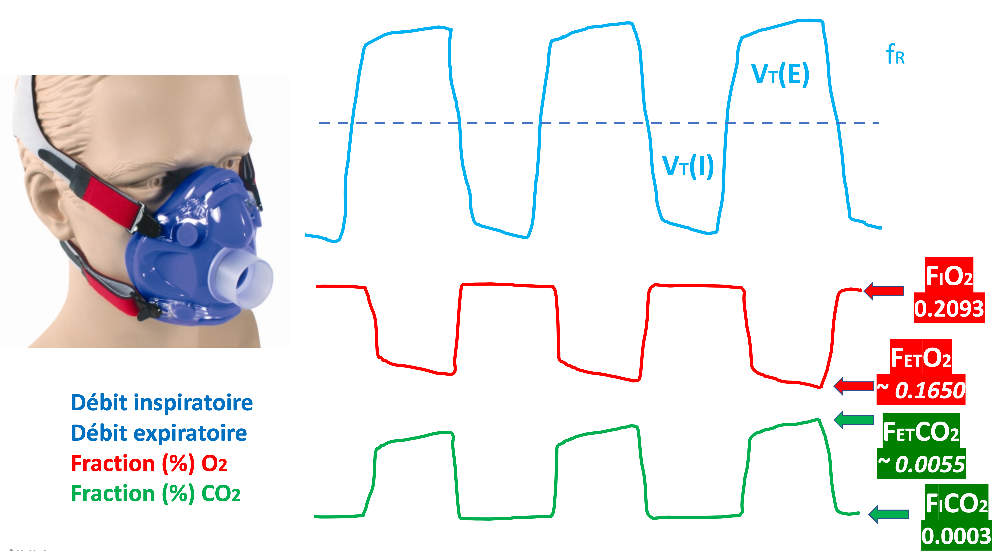

# Qu'est ce que c'est

* La *spirométrie* est un test à l'effort visant à mesurer les gaz inhalés & expiré d'un patient.  
  Pendant le test, on va mesurer les gaz 1. au repos, 2. en augmentant l'effort demandé (pallier par pallier) et 3. de nouveau au repos (en récupération).

  

* L'effort demandé peut être mesuré
  - en watts lorsqu'on utilise un vélo,
  - ou en vitesse & inclinaison avec un tapis de course

  Pour certaines machines, passer d'un pallier à l'autre se fait rectangulairement (ex on passe de 10 à 20 watts); pour d'autre, graduellement (ex on passe de 10 à 12, 15 et 20).

* On peut également mesurer les gaz du sang, soit en effectuant une prise sanguine par voie artérielle (au poignet), soit par voie artério-veineuse (au lobe de l'oreille) — qui donne une mesure moins précise mais est moins invasive.

# Mesures

| Français | Anglais | Unité
|---       |---      |---
| CV, CVL (Capacité vitale lente) | SVC (Slow Vital Capacity) | L
| CVF (Capacité Vitale Forcée) | FCV (Forced Vital Capacity) | L BTPS
| VEMS (Volume Expiratoire Max en 1 sec) | FEV1 (Forced Expiratory Volume 1 sec) | L
| DLCO | TLCO (Transfer factor for carbon monoxide) — UK,  DLCO (Diffusing Capacity of Lung for Carbon Monoxide) — USA | mlCO/min/mmHG ou mmolCO/min/kPa
| CI (Capacité inspiratoire) | IC (Inspiratory Capacity) | L BTPS
| CRF (Capacité résiduelle fonctionnelle) | FRC (Functional residual capacity) | L BTPS
VA (Volume alvéolaire) | AV Helium (Alveolar volume, determined by single-breath helium dilution) | L
| VRE (Volume de réserve expiratoire) | ERV (Expiratory reserve volume) | L BTPS
| KCO | KCO (Carbon monoxide transfer coefficient) | Kpa ou mL/mmHg/min
| DEMM (Débit expiratoire maximal médian 25-75) | MMFR (Maximum Mid-expiratory Flow Rate) | L/sec
| CPT (Capacité pulmonaire totale) | TLC (Total lung capacity) | L BTPS
| VR (Volume résiduel) | RV (Residual volume), TV ou VT (Tidal volume) | L BTPS
| VEMS/CVF (rapport de Tiffeneau) | FVC/FEV1 | %

# Prédites

* Les valeurs de spirométrie (mesure des gaz inhalés & expirés) ont été recueillis auprès de chercheurs et profesionnels de la santé du monde entier. En ont découlé des formules permettant de calculer la valeur normale pour un individu de sexe/taille/âge donné.

- **GLI**  
  Les dernières formules en date sont celles de l'organisme GLI (*Global Lung Function Initiative*)  
  Décrites dans <ins>Gillien and al. Les nouvelles formules de référence du GLI pour les explorations fonctionnelles respiratoires, 2018</ins>

- **ERS/ATS**  
  Les formules qui étaient historiquement utilisées étaient celles d'ERS (*European Respiratory Society*) / ATS (*American Thorax Society*)  
  Décrites dans <ins>Quanjer and al. Lung Volumes and Forced Ventilatory Flows, 1993</ins>

  [Formules](predicted)
